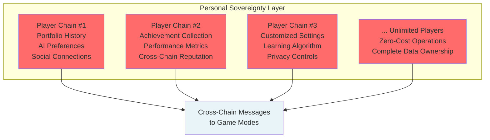
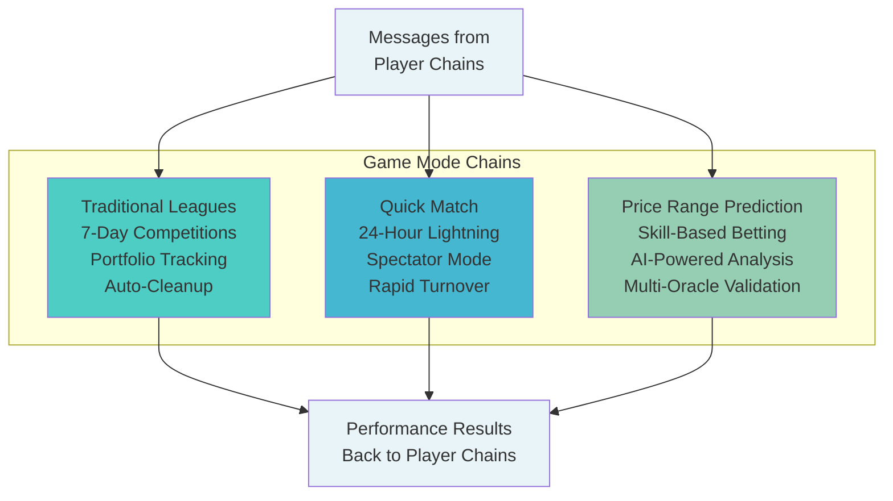
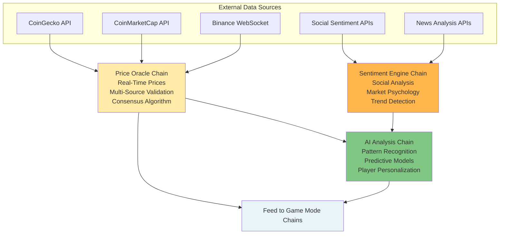
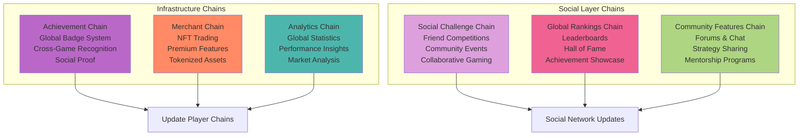

# Technical Implementation Guide

This guide provides the technical implementation details for building CoinDrafts on Linera. It includes code examples, data structures, and specific implementation patterns for each component.

## Implementation Architecture

Building on the [Linera Protocol concepts](/docs/linera-architecture/overview), here's how we implement each component with actual Rust code and Linera-specific features.

### Layer 1: Personal Player Chains



### Layer 2: Game Mode Microchains



### Layer 3: Oracle & AI Network



### Layer 4: Infrastructure & Social



### Layer 5: Cross-Chain Integration Flow

```mermaid
graph LR
    PlayerAction[Player Action<br/>Portfolio Submission] --> PlayerChain[Personal Chain Update]

    PlayerChain --> CrossMsg[Cross-Chain Message]
    CrossMsg --> GameChain[Game Mode Chain]

    GameChain --> OracleReq[Request Oracle Data]
    OracleReq --> OracleChain[Oracle Network]

    OracleChain --> GameResult[Calculate Results]
    GameResult --> UpdatePlayer[Update Player Chain]

    UpdatePlayer --> SocialUpdate[Update Social/Achievement Chains]
    SocialUpdate --> GlobalState[Global State Consistency]

    style PlayerAction fill:#e1f5fe
    style PlayerChain fill:#ff6b6b
    style GameChain fill:#4ecdc4
    style OracleChain fill:#ffeaa7
    style SocialUpdate fill:#dda0dd
    style GlobalState fill:#c8e6c9
```



## 1. Personal Player Chains (Unlimited)

Each player receives their own sovereign microchain for complete data ownership and zero-cost interactions.

### 🏠 Portfolio History & Performance

```rust
#[derive(RootView)]
#[view(context = ViewStorageContext)]
pub struct PlayerChain {
    /// Complete portfolio history across all game modes
    pub portfolio_history: LogView<PortfolioEntry>,

    /// Real-time performance tracking with sub-second updates
    pub performance_metrics: MapView<Timestamp, PerformanceSnapshot>,

    /// Cross-game-mode statistics and analytics
    pub personal_stats: RegisterView<PlayerStatistics>,
}

#[derive(Debug, Clone, Serialize, Deserialize)]
pub struct PortfolioEntry {
    pub game_mode: GameMode,
    pub league_id: ChainId,
    pub cryptocurrencies: Vec<CryptoSelection>,
    pub submission_time: Timestamp,
    pub final_performance: Option<f64>,
    pub final_ranking: Option<u32>,
    pub ai_assistance_level: AIAssistanceLevel,
}
```

### 🤖 AI Preference Learning

```rust
#[derive(Debug, Clone, Serialize, Deserialize)]
pub struct PlayerAIProfile {
    /// Learned risk tolerance from historical decisions
    pub risk_tolerance: f64,

    /// Preferred cryptocurrency sectors and categories
    pub preferred_sectors: Vec<CryptoSector>,

    /// Timing patterns and submission behavior analysis
    pub timing_patterns: TimingAnalysis,

    /// Success factors correlated with winning strategies
    pub success_patterns: SuccessFactors,

    /// Personalized AI model weights and preferences
    pub model_customization: AIModelWeights,
}
```

### 🤝 Social Connections & Badges

```rust
/// Social connections with other players
pub social_connections: MapView<AccountOwner, SocialConnection>,

/// Dynamic achievement collection with evolution
pub achievements: MapView<AchievementType, DynamicAchievement>,

#[derive(Debug, Clone, Serialize, Deserialize)]
pub struct DynamicAchievement {
    pub badge_type: BadgeType,
    pub level: u32,
    pub earned_timestamp: Timestamp,
    pub dynamic_metadata: BadgeMetadata,
    pub social_endorsements: Vec<Endorsement>,
    pub utility_unlocks: Vec<FeatureUnlock>,
}
```

### 🌐 Cross-Chain Reputation

```rust
/// Global reputation across all Linera applications
pub global_reputation: RegisterView<CrossChainReputation>,

#[derive(Debug, Clone, Serialize, Deserialize)]
pub struct CrossChainReputation {
    pub coindrafts_score: f64,
    pub external_app_scores: HashMap<ChainId, f64>,
    pub verified_achievements: Vec<VerifiedAchievement>,
    pub reputation_history: Vec<ReputationEvent>,
    pub cross_chain_endorsements: Vec<CrossChainEndorsement>,
}
```

## 2. League Microchains (Temporary)

Dedicated microchains for each game instance ensure perfect isolation and unlimited scalability.

### 📊 Participant Portfolios

```rust
#[derive(RootView)]
#[view(context = ViewStorageContext)]
pub struct LeagueChain {
    /// All participant portfolios with real-time tracking
    pub portfolios: MapView<AccountOwner, ActivePortfolio>,

    /// League configuration and rules
    pub config: RegisterView<LeagueConfig>,

    /// Automatic expiry for temporary leagues
    pub expiry_time: RegisterView<Timestamp>,
}

#[derive(Debug, Clone, Serialize, Deserialize)]
pub struct ActivePortfolio {
    pub player: AccountOwner,
    pub cryptocurrencies: Vec<CryptoSelection>,
    pub current_performance: f64,
    pub historical_performance: Vec<PerformancePoint>,
    pub volatility_score: f64,
    pub risk_score: f64,
}
```

### 🏆 Live Rankings & Updates

```rust
/// Real-time leaderboard with 30-second updates
pub live_rankings: RegisterView<LiveLeaderboard>,

/// Performance update stream for analytics
pub performance_stream: LogView<PerformanceUpdate>,

#[derive(Debug, Clone, Serialize, Deserialize)]
pub struct LiveLeaderboard {
    pub rankings: Vec<LeaderboardEntry>,
    pub last_update: Timestamp,
    pub total_participants: u32,
    pub time_remaining: Duration,
    pub current_prize_pool: Amount,
    pub volatility_index: f64,
}
```

### 💰 Prize Distribution Logic

```rust
/// Dynamic prize system with automatic distribution
pub prize_system: RegisterView<PrizeDistribution>,

/// Automatic prize calculation and distribution
impl LeagueContract {
    async fn distribute_prizes(&mut self) -> Result<(), ContractError> {
        let final_rankings = self.live_rankings.get();
        let prize_config = self.prize_system.get();

        // Distribute prizes based on performance tiers
        for (tier, percentage) in prize_config.distribution_tiers {
            let tier_prize = prize_config.total_pool.multiply_by_float(percentage);
            let tier_winners = self.get_tier_winners(tier);

            for winner in tier_winners {
                self.runtime.transfer(winner.player, tier_prize).await?;
            }
        }
    }
}
```

### 🏪 Merchant Branding Config

```rust
/// Merchant customization and branding
pub merchant_branding: RegisterView<MerchantBrandConfig>,

#[derive(Debug, Clone, Serialize, Deserialize)]
pub struct MerchantBrandConfig {
    pub merchant_id: AccountOwner,
    pub custom_theme: BrandTheme,
    pub logo_uri: String,
    pub custom_prize_structure: Option<PrizeStructure>,
    pub customer_rewards: Vec<CustomerReward>,
    pub analytics_access: AnalyticsPermissions,
}
```

## 3. Oracle Microchains (Persistent)

Professional-grade oracle infrastructure enabling advanced market analysis and decision support.

### 📈 Multi-Source Price Aggregation

```rust
#[derive(RootView)]
#[view(context = ViewStorageContext)]
pub struct PriceOracleChain {
    /// Current prices from multiple sources
    pub current_prices: MapView<String, PriceData>,

    /// Historical price data for trend analysis
    pub price_history: LogView<PriceUpdate>,

    /// Oracle source reliability tracking
    pub source_reliability: MapView<String, ReliabilityMetrics>,

    /// Active subscribers (leagues and players)
    pub subscribers: MapView<ChainId, SubscriptionConfig>,
}

impl PriceOracleContract {
    /// Query multiple price sources simultaneously
    async fn aggregate_prices(&mut self, crypto: &str) -> Result<ConsensusPriceData, OracleError> {
        let sources = vec![
            self.query_coingecko(crypto),
            self.query_binance(crypto),
            self.query_coinbase(crypto),
            self.query_kraken(crypto),
            self.query_chainlink(crypto),
        ];

        let results = futures::try_join_all(sources).await?;
        self.calculate_consensus_price(results)
    }
}
```

### 📰 News & Sentiment Analysis

```rust
#[derive(RootView)]
#[view(context = ViewStorageContext)]
pub struct SentimentEngineChain {
    /// Real-time sentiment scores from multiple sources
    pub sentiment_scores: MapView<String, SentimentData>,

    /// News article analysis and classification
    pub news_analysis: LogView<NewsAnalysis>,

    /// Social media sentiment tracking
    pub social_sentiment: MapView<String, SocialSentimentData>,

    /// Fear & Greed index and market psychology
    pub market_psychology: RegisterView<MarketPsychologyIndex>,
}

impl SentimentEngineContract {
    /// Analyze market sentiment from multiple sources
    async fn analyze_sentiment(&mut self, crypto: &str) -> Result<ComprehensiveSentiment, SentimentError> {
        let (news_sentiment, social_sentiment, technical_sentiment) = futures::try_join!(
            self.analyze_news_sentiment(crypto),
            self.analyze_social_sentiment(crypto),
            self.analyze_technical_sentiment(crypto)
        )?;

        self.combine_sentiment_signals(news_sentiment, social_sentiment, technical_sentiment)
    }
}
```

### 🧠 AI Model Hosting & Updates

```rust
#[derive(RootView)]
#[view(context = ViewStorageContext)]
pub struct AIAnalysisChain {
    /// Machine learning models for market prediction
    pub ml_models: MapView<String, MLPredictionModel>,

    /// Technical analysis indicators and signals
    pub technical_models: MapView<String, TechnicalAnalysisModel>,

    /// Player strategy recommendations
    pub strategy_recommendations: MapView<AccountOwner, AIStrategyRecommendation>,

    /// Model performance tracking and updates
    pub model_performance: LogView<ModelPerformanceMetric>,
}

impl AIAnalysisContract {
    /// Generate comprehensive market analysis
    async fn generate_analysis(&mut self, crypto: &str) -> Result<ComprehensiveAnalysis, AIError> {
        let (price_data, sentiment_data, fundamental_data) = futures::try_join!(
            self.get_price_analysis(crypto),
            self.get_sentiment_analysis(crypto),
            self.get_fundamental_analysis(crypto)
        )?;

        self.run_ml_prediction_ensemble(price_data, sentiment_data, fundamental_data).await
    }
}
```

### 📊 Market Intelligence

```rust
#[derive(RootView)]
#[view(context = ViewStorageContext)]
pub struct MarketIntelligenceChain {
    /// Cross-asset correlation analysis
    pub correlation_matrix: RegisterView<AssetCorrelationMatrix>,

    /// Market trend identification and forecasting
    pub trend_analysis: MapView<String, TrendAnalysis>,

    /// Volatility predictions and risk metrics
    pub volatility_models: MapView<String, VolatilityModel>,

    /// Economic indicator impact analysis
    pub macro_analysis: RegisterView<MacroEconomicAnalysis>,
}
```

## 4. Merchant Chains (Persistent)

Dedicated infrastructure for e-commerce integration and merchant services.

### 🛒 E-commerce Integration

```rust
#[derive(RootView)]
#[view(context = ViewStorageContext)]
pub struct MerchantChain {
    /// Shopify and e-commerce platform integration
    pub store_config: RegisterView<EcommerceConfig>,

    /// Product catalog and inventory management
    pub product_catalog: MapView<ProductId, Product>,

    /// Order processing and fulfillment
    pub orders: MapView<OrderId, Order>,

    /// Payment processing and crypto integration
    pub payment_processor: RegisterView<PaymentConfig>,
}

#[derive(Debug, Clone, Serialize, Deserialize)]
pub struct EcommerceConfig {
    pub shopify_store_url: String,
    pub api_credentials: ShopifyCredentials,
    pub webhook_endpoints: Vec<WebhookEndpoint>,
    pub inventory_sync: InventorySyncConfig,
}
```

### 🎁 Customer Reward Management

```rust
/// Customer reward and loyalty program
pub customer_rewards: MapView<AccountOwner, CustomerRewardProfile>,

/// NFT discount and exclusive access management
pub nft_rewards: MapView<NFTId, NFTReward>,

#[derive(Debug, Clone, Serialize, Deserialize)]
pub struct CustomerRewardProfile {
    pub customer: AccountOwner,
    pub loyalty_points: u64,
    pub tier_status: CustomerTier,
    pub available_rewards: Vec<AvailableReward>,
    pub purchase_history: Vec<Purchase>,
    pub nft_collection: Vec<NFTReward>,
}
```

### 🏅 Branded League Hosting

```rust
/// Merchant-sponsored league management
pub branded_leagues: MapView<LeagueId, MerchantLeague>,

/// Custom tournament and event hosting
pub merchant_events: LogView<MerchantEvent>,

#[derive(Debug, Clone, Serialize, Deserialize)]
pub struct MerchantLeague {
    pub merchant: AccountOwner,
    pub league_config: CustomLeagueConfig,
    pub prize_sponsorship: Amount,
    pub branding: BrandingConfig,
    pub customer_incentives: Vec<CustomerIncentive>,
}
```

### 📈 Sales & Analytics Tracking

```rust
/// Comprehensive sales analytics and insights
pub sales_analytics: LogView<SalesEvent>,

/// Customer behavior and engagement metrics
pub customer_analytics: MapView<AccountOwner, CustomerAnalytics>,

/// ROI tracking for league sponsorships
pub roi_metrics: RegisterView<MerchantROIMetrics>,

impl MerchantContract {
    /// Generate comprehensive merchant analytics
    async fn generate_analytics_report(&self) -> MerchantAnalyticsReport {
        MerchantAnalyticsReport {
            sales_metrics: self.calculate_sales_metrics().await?,
            customer_acquisition: self.calculate_customer_acquisition().await?,
            league_performance: self.analyze_league_performance().await?,
            roi_analysis: self.calculate_roi_metrics().await?,
        }
    }
}
```

## 5. Social Event Streams (Global)

Real-time social features powered by Linera's event stream architecture.

### 🎉 Achievement Celebrations

```rust
/// Global achievement celebration system
pub achievement_stream: EventStream<AchievementEvent>,

#[derive(Debug, Clone, Serialize, Deserialize)]
pub enum AchievementEvent {
    BadgeEarned {
        player: AccountOwner,
        badge: BadgeType,
        rarity: BadgeRarity,
        celebration_tier: CelebrationType,
    },
    MilestoneReached {
        player: AccountOwner,
        milestone: MilestoneType,
        progress: ProgressData,
    },
    PersonalRecord {
        player: AccountOwner,
        record_type: RecordType,
        new_value: f64,
        improvement: f64,
    },
}
```

### 🏆 Victory Announcements

```rust
/// Victory and competition result broadcasts
pub victory_stream: EventStream<VictoryEvent>,

#[derive(Debug, Clone, Serialize, Deserialize)]
pub enum VictoryEvent {
    LeagueVictory {
        winner: AccountOwner,
        league_type: GameMode,
        performance: f64,
        prize_amount: Amount,
        participants: u32,
    },
    PerfectPrediction {
        predictor: AccountOwner,
        crypto: String,
        accuracy: f64,
        difficulty_multiplier: f64,
    },
    CombackVictory {
        player: AccountOwner,
        rank_improvement: u32,
        final_performance: f64,
    },
}
```

### 💡 Strategy Sharing

```rust
/// Strategy sharing and educational content
pub strategy_stream: EventStream<StrategyEvent>,

#[derive(Debug, Clone, Serialize, Deserialize)]
pub enum StrategyEvent {
    StrategyShare {
        author: AccountOwner,
        strategy: StrategyBreakdown,
        performance_proof: PerformanceProof,
        educational_value: f64,
    },
    MarketInsight {
        analyst: AccountOwner,
        insight: MarketInsight,
        accuracy_track_record: f64,
    },
    TipSharing {
        mentor: AccountOwner,
        tip: TradingTip,
        community_rating: f64,
    },
}
```

### 🎯 Community Challenges

```rust
/// Community-wide challenges and competitions
pub challenge_stream: EventStream<CommunityChallenge>,

#[derive(Debug, Clone, Serialize, Deserialize)]
pub enum CommunityChallenge {
    WeeklyChallenge {
        challenge_id: String,
        challenge_type: ChallengeType,
        requirements: ChallengeRequirements,
        rewards: Vec<ChallengeReward>,
        leaderboard: Vec<ChallengeParticipant>,
    },
    SeasonalEvent {
        event_name: String,
        duration: Duration,
        special_rules: Vec<SpecialRule>,
        community_goals: Vec<CommunityGoal>,
    },
    CollaborativeGoal {
        goal_description: String,
        current_progress: f64,
        target_value: f64,
        participant_contributions: HashMap<AccountOwner, f64>,
    },
}
```

## Cross-Chain Communication Patterns

### Message Flow Architecture

```rust
// Cross-chain message routing and handling
impl CrossChainRouter {
    async fn route_message(&mut self, message: CrossChainMessage) -> Result<(), RoutingError> {
        match message.destination_type {
            ChainType::PlayerChain => {
                self.send_to_player_chain(message).await?;
            }
            ChainType::LeagueChain => {
                self.send_to_league_chain(message).await?;
            }
            ChainType::OracleChain => {
                self.send_to_oracle_chain(message).await?;
            }
            ChainType::MerchantChain => {
                self.send_to_merchant_chain(message).await?;
            }
        }

        // Update global event streams
        self.publish_to_event_streams(message).await?;
        Ok(())
    }
}
```

### Data Synchronization

```rust
// Real-time data synchronization across chains
impl DataSyncManager {
    async fn sync_portfolio_update(&mut self, update: PortfolioUpdate) -> Result<(), SyncError> {
        // Update player's personal chain
        self.update_player_chain(update.player, &update).await?;

        // Update relevant league chains
        for league_id in update.active_leagues {
            self.update_league_chain(league_id, &update).await?;
        }

        // Trigger AI analysis updates
        self.trigger_ai_analysis(update.portfolio_changes).await?;

        // Publish to social streams
        self.publish_social_updates(&update).await?;

        Ok(())
    }
}
```

## Performance & Scalability Metrics

### Chain Performance Characteristics

| Chain Type          | Update Frequency | Scalability        | Persistence | Gas Costs  |
| ------------------- | ---------------- | ------------------ | ----------- | ---------- |
| **Player Chains**   | Real-time        | Unlimited          | Permanent   | Zero reads |
| **League Chains**   | 30 seconds       | Unlimited parallel | Temporary   | Minimal    |
| **Oracle Chains**   | Variable         | High throughput    | Permanent   | Optimized  |
| **Merchant Chains** | On-demand        | Per merchant       | Permanent   | Standard   |
| **Event Streams**   | Real-time        | Global scale       | Archived    | Broadcast  |

### Resource Utilization

```rust
// Performance monitoring and optimization
#[derive(Debug, Clone, Serialize, Deserialize)]
pub struct ChainPerformanceMetrics {
    pub transactions_per_second: f64,
    pub average_latency: Duration,
    pub storage_utilization: f64,
    pub cross_chain_message_volume: u64,
    pub oracle_query_frequency: f64,
    pub event_stream_throughput: u64,
}
```

This comprehensive architecture leverages every aspect of Linera's revolutionary capabilities to create an ecosystem that's impossible to replicate on traditional blockchains. The combination of unlimited personal chains, temporary game chains, persistent oracle infrastructure, merchant integration, and real-time social features creates the world's most advanced cryptocurrency fantasy gaming platform.

---

_Complete ecosystem architecture powered by Linera's revolutionary multi-chain capabilities_ 🌐⚡
