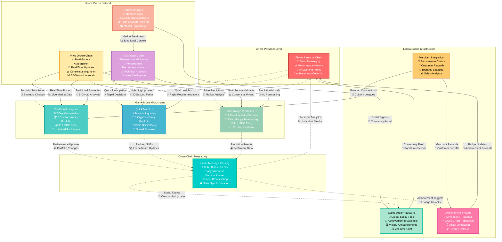

# Game Modes Overview

CoinDrafts on Linera offers three distinct game modes, each leveraging unique aspects of the Linera protocol to deliver unprecedented gaming experiences. Every game mode is built on microchain architecture for optimal performance and user experience.

## Game Mode Architecture



## 🎯 Strategy Systems Integration

CoinDrafts incorporates sophisticated strategy layers that reward skill, research, and tactical decision-making across all game modes. These systems leverage Linera's microchain architecture for real-time strategy execution.

### Core Strategy Features

**MVP Strategy Features (Available at Launch):**

- 🎲 **Risk Multipliers** - Volatility-based scoring with up to 5% performance boosts
- 🤖 **AI Confidence Score** - TensorFlow.js predictions with bonus point system
- 🔗 **Team Synergy** - Sector-based bonuses (DeFi, Gaming, Infrastructure, Meme coins)
- ⚖️ **Diversification Rules** - Portfolio balance requirements with reward multipliers

**Advanced Features (Post-MVP):**

- 🔒 **Conviction Picks** - Lock cryptocurrencies across 3 leagues for 3x multipliers
- 💰 **Double-Down Feature** - Stake extra USDC for 2x weight on confident picks
- 🎴 **Trade-Off Cards** - Mid-game tactical decisions (Pivot, Shield, Boost cards)

### Game Mode Strategy Integration

Each game mode leverages different aspects of the strategy system:

- **Traditional Leagues**: All strategy features available for maximum depth
- **Quick Match**: Simplified strategy (Risk Multipliers + AI Confidence) for fast decisions
- **Price Range Prediction**: AI-heavy with confidence scores and sector analysis

### 📖 Complete Strategy Guide

For detailed information about all strategy features, implementation details, and advanced tactics, see our comprehensive **[Strategy Systems Overview](/docs/strategy-systems/overview)**.

---

## Traditional Leagues

### Overview

The classic CoinDrafts experience enhanced with Linera's real-time capabilities.

**Duration**: 7 days (Monday to Monday)  
**Portfolio Size**: 5 cryptocurrencies  
**Entry Fee**: $1 USDC  
**Participants**: Unlimited (parallel league chains)

### Linera Protocol Features Used

#### Personal Player Chains

```rust
// Each player has their own microchain for portfolio management
#[derive(RootView, async_graphql::SimpleObject)]
#[view(context = ViewStorageContext)]
pub struct PlayerChain {
    // Portfolio history across all leagues
    pub portfolio_history: LogView<Portfolio>,

    // Performance analytics and AI learning
    pub performance_metrics: MapView<Timestamp, PerformanceData>,

    // AI preference learning for better suggestions
    pub ai_preferences: RegisterView<AIPreferences>,

    // Social connections and sharing
    pub friend_connections: MapView<AccountOwner, FriendStatus>,

    // Achievement collection with dynamic progression
    pub achievements: MapView<BadgeType, DynamicAchievement>,
}
```

#### Dedicated League Chains

```rust
// Each league gets its own temporary microchain
#[derive(RootView)]
#[view(context = ViewStorageContext)]
pub struct LeagueChain {
    // League configuration and rules
    pub config: RegisterView<LeagueConfig>,

    // All participant portfolios
    pub portfolios: MapView<AccountOwner, Portfolio>,

    // Real-time leaderboard (updated every 30 seconds)
    pub leaderboard: RegisterView<Leaderboard>,

    // Prize pool and distribution rules
    pub prize_system: RegisterView<PrizeDistribution>,

    // Social features for league participants
    pub league_chat: LogView<ChatMessage>,
    pub portfolio_shares: LogView<PortfolioShare>,
}
```

### Real-Time Performance Updates

**Traditional Blockchain Limitation**: Hourly price updates due to gas costs  
**Linera Solution**: Real-time updates via cross-chain messaging

```rust
// Price oracle sends updates to all active leagues
impl PriceOracleContract {
    async fn broadcast_price_update(&mut self, price_data: PriceUpdate) {
        // Get all active league chains
        let active_leagues = self.get_active_leagues().await?;

        // Send update to each league simultaneously
        for league_chain in active_leagues {
            self.runtime.send_message(
                league_chain,
                OracleMessage::PriceUpdate(price_data.clone())
            ).await?;
        }

        // Also update all player chains for personal tracking
        let active_players = self.get_active_players().await?;
        for player_chain in active_players {
            self.runtime.send_message(
                player_chain,
                OracleMessage::PriceUpdate(price_data.clone())
            ).await?;
        }
    }
}

// League chains process updates and recalculate rankings
impl LeagueContract {
    async fn execute_message(&mut self, message: OracleMessage) {
        match message {
            OracleMessage::PriceUpdate(price_data) => {
                // Update all portfolio performances
                self.update_all_portfolios(price_data).await?;

                // Recalculate leaderboard
                let new_rankings = self.calculate_rankings().await?;
                self.leaderboard.set(new_rankings.clone());

                // Notify participants of ranking changes
                for (player, new_rank) in new_rankings.iter().enumerate() {
                    if self.rank_changed(player, new_rank) {
                        self.runtime.send_message(
                            new_rank.player_chain,
                            LeagueMessage::RankingUpdate {
                                new_position: new_rank.position,
                                performance: new_rank.performance,
                            }
                        ).await?;
                    }
                }

                // Publish to global event stream for social features
                self.runtime.publish_event(GameEvent::LeaderboardUpdate {
                    league_id: self.league_id(),
                    top_performers: new_rankings.into_iter().take(10).collect(),
                }).await?;
            }
        }
    }
}
```

---

## Quick Match ⚡

### Overview

Fast-paced 24-hour leagues for casual gaming and rapid engagement.

**Duration**: 24 hours  
**Portfolio Size**: 3 cryptocurrencies (simplified)  
**Entry Fee**: $0.50 USDC (lower barrier to entry)  
**Update Frequency**: Every 30 seconds (ultra-responsive)

### Linera Protocol Features Used

#### Temporary Quick Match Chains

```rust
// Lightweight chains with automatic cleanup
#[derive(RootView)]
#[view(context = ViewStorageContext)]
pub struct QuickMatchChain {
    // Quick match specific configuration
    pub config: RegisterView<QuickMatchConfig>,

    // Simplified portfolio structure (3 cryptos only)
    pub quick_portfolios: MapView<AccountOwner, QuickPortfolio>,

    // High-frequency leaderboard updates
    pub live_rankings: RegisterView<LiveRankings>,

    // Spectator mode for non-participants
    pub spectators: MapView<AccountOwner, SpectatorPreferences>,

    // Auto-expiry timestamp
    pub expiry_time: RegisterView<Timestamp>,
}

#[derive(Debug, Clone, Serialize, Deserialize)]
pub struct QuickPortfolio {
    pub cryptocurrencies: [CryptoSelection; 3], // Fixed array size
    pub submission_time: Timestamp,
    pub last_update: Timestamp,
    pub current_performance: f64,
    pub peak_performance: f64,
    pub volatility_score: f64,
}
```

#### Ultra-Fast Price Processing

```rust
impl QuickMatchContract {
    // Optimized for 30-second update cycles
    async fn process_rapid_price_update(&mut self, price_update: RapidPriceUpdate) {
        // Batch process all portfolios efficiently
        let mut ranking_changes = Vec::new();

        for (player, portfolio) in self.quick_portfolios.iter_mut() {
            let old_performance = portfolio.current_performance;

            // Calculate new performance with optimized algorithm
            let new_performance = self.calculate_quick_performance(
                &portfolio.cryptocurrencies,
                &price_update
            );

            portfolio.current_performance = new_performance;
            portfolio.last_update = self.runtime.current_timestamp();

            // Track significant changes for notifications
            if (new_performance - old_performance).abs() > 0.05 { // 5% change threshold
                ranking_changes.push(RankingChange {
                    player: *player,
                    old_performance,
                    new_performance,
                    change_magnitude: new_performance - old_performance,
                });
            }
        }

        // Update leaderboard with new rankings
        let new_rankings = self.calculate_live_rankings().await?;
        self.live_rankings.set(new_rankings);

        // Send rapid notifications to players with significant changes
        for change in ranking_changes {
            self.runtime.send_message(
                change.player,
                QuickMatchMessage::RapidUpdate {
                    performance_change: change.change_magnitude,
                    new_rank: self.get_player_rank(change.player),
                    time_remaining: self.time_until_expiry(),
                }
            ).await?;
        }
    }

    // Automatic chain cleanup after 24 hours
    async fn check_expiry(&mut self) {
        if self.runtime.current_timestamp() >= self.expiry_time.get() {
            // Finalize results and distribute prizes
            let final_rankings = self.finalize_quick_match().await?;
            self.distribute_quick_prizes(final_rankings).await?;

            // Mark chain for expiry
            self.runtime.mark_for_expiry().await?;
        }
    }
}
```

#### Spectator Mode with Live Updates

```rust
// Non-participants can watch quick matches in real-time
impl QuickMatchService {
    async fn subscribe_to_live_feed(&self, spectator: AccountOwner) -> StreamSubscription {
        // Create real-time subscription for spectators
        let subscription = self.runtime.create_subscription(
            StreamType::QuickMatchLive,
            Some(spectator)
        ).await?;

        subscription
    }

    async fn get_live_leaderboard(&self) -> QuickMatchLeaderboard {
        let rankings = self.live_rankings.get();

        QuickMatchLeaderboard {
            positions: rankings.into_iter().enumerate().map(|(index, entry)| {
                LeaderboardPosition {
                    rank: index + 1,
                    player: entry.player,
                    performance: entry.performance,
                    portfolio: entry.portfolio_summary,
                    time_in_position: entry.time_at_rank,
                    trend: entry.recent_trend,
                }
            }).collect(),
            time_remaining: self.time_until_expiry(),
            total_participants: self.quick_portfolios.count(),
            prize_pool: self.calculate_current_prize_pool(),
        }
    }
}
```

---

## Price Range Prediction 🎯

### Overview

Skill-based prediction markets where players forecast exact price ranges for cryptocurrencies.

**Duration**: 7 days (prediction window)  
**Challenge**: Predict price range (e.g., BTC $65,000-$67,000)  
**Entry Fee**: $1 USDC (with dynamic multipliers)  
**Validation**: Multi-source oracle consensus

### Linera Protocol Features Used

#### Prediction Market Chains

```rust
// Sophisticated prediction market implementation
#[derive(RootView)]
#[view(context = ViewStorageContext)]
pub struct PredictionMarketChain {
    // Market configuration and target asset
    pub market_config: RegisterView<PredictionMarketConfig>,

    // All player predictions with confidence scoring
    pub predictions: MapView<AccountOwner, PriceRangePrediction>,

    // Confidence pools for meta-gaming
    pub confidence_pools: MapView<PriceRange, ConfidencePool>,

    // AI market analysis and insights
    pub ai_insights: RegisterView<AIMarketAnalysis>,

    // Multi-source price validation system
    pub price_validators: MapView<OracleSource, PriceValidation>,

    // Dynamic difficulty and reward system
    pub difficulty_metrics: RegisterView<DifficultyMetrics>,
}

#[derive(Debug, Clone, Serialize, Deserialize)]
pub struct PriceRangePrediction {
    pub player: AccountOwner,
    pub target_crypto: String,
    pub predicted_range: PriceRange,
    pub confidence_level: f64, // 0.0 to 1.0
    pub reasoning: String, // Player's analysis
    pub stake_multiplier: f64, // Based on difficulty
    pub submission_time: Timestamp,
    pub ai_assisted: bool, // Used AI suggestions
}

#[derive(Debug, Clone, Serialize, Deserialize)]
pub struct PriceRange {
    pub min_price: Amount,
    pub max_price: Amount,
    pub range_width: Amount,
    pub difficulty_score: f64, // Smaller range = higher difficulty
}
```

#### Multi-Source Oracle Validation

```rust
// Advanced price validation using multiple oracles
impl PredictionMarketContract {
    async fn validate_final_price(&mut self, target_crypto: String) -> ValidationResult {
        // Query multiple price sources simultaneously
        let price_sources = vec![
            self.query_coingecko_price(&target_crypto),
            self.query_binance_price(&target_crypto),
            self.query_coinbase_price(&target_crypto),
            self.query_kraken_price(&target_crypto),
            self.query_chainlink_feed(&target_crypto),
        ];

        // Await all price queries in parallel
        let price_results = futures::try_join_all(price_sources).await?;

        // Apply consensus algorithm with outlier detection
        let consensus_price = self.calculate_consensus_price(price_results)?;

        // Validate consensus quality
        let validation_quality = self.assess_consensus_quality(&price_results, consensus_price);

        if validation_quality.confidence < 0.95 {
            // If consensus is poor, extend validation period
            return ValidationResult::RequiresExtendedValidation {
                current_consensus: consensus_price,
                confidence: validation_quality.confidence,
                retry_after: Duration::hours(1),
            };
        }

        ValidationResult::Validated {
            final_price: consensus_price,
            confidence: validation_quality.confidence,
            sources_used: validation_quality.sources_count,
        }
    }

    async fn query_coingecko_price(&self, crypto: &str) -> Result<PriceSource, OracleError> {
        let response = self.runtime.http_query(&format!(
            "https://api.coingecko.com/api/v3/simple/price?ids={}&vs_currencies=usd&include_last_updated_at=true",
            crypto
        )).await?;

        let price_data: CoinGeckoResponse = serde_json::from_str(&response)?;

        Ok(PriceSource {
            source: "coingecko".to_string(),
            price: Amount::from_str(&price_data.usd.to_string())?,
            timestamp: Timestamp::from_nanoseconds_since_epoch(price_data.last_updated_at * 1_000_000_000),
            confidence: 0.95, // CoinGecko reliability score
        })
    }
}
```

#### Dynamic Difficulty & Reward System

```rust
impl PredictionMarketContract {
    async fn calculate_prediction_multiplier(&self, prediction: &PriceRangePrediction) -> f64 {
        // Base multiplier from range difficulty
        let range_multiplier = match prediction.predicted_range.range_width.as_u64() {
            0..=100 => 20.0,      // $1 range = 20x (extremely difficult)
            101..=500 => 10.0,    // $5 range = 10x (very difficult)
            501..=1000 => 5.0,    // $10 range = 5x (difficult)
            1001..=2000 => 2.5,   // $20 range = 2.5x (moderate)
            2001..=5000 => 1.5,   // $50 range = 1.5x (easy)
            _ => 1.0,             // >$50 range = 1x (very easy)
        };

        // Confidence level adjustment
        let confidence_multiplier = prediction.confidence_level * 1.5;

        // Market volatility adjustment
        let volatility_multiplier = self.get_current_volatility_multiplier().await?;

        // AI assistance penalty
        let ai_penalty = if prediction.ai_assisted { 0.8 } else { 1.0 };

        // Time decay bonus (earlier predictions get bonus)
        let time_bonus = self.calculate_time_bonus(prediction.submission_time);

        range_multiplier * confidence_multiplier * volatility_multiplier * ai_penalty * time_bonus
    }

    async fn create_confidence_pools(&mut self, prediction: PriceRangePrediction) {
        // Players can bet on others' confidence levels
        let range_key = prediction.predicted_range.clone();

        let mut pool = self.confidence_pools.get(&range_key).unwrap_or_default();

        pool.add_prediction(
            prediction.player,
            prediction.confidence_level,
            prediction.stake_multiplier
        );

        // Meta-gaming: other players can bet on this prediction's success
        pool.open_for_secondary_betting(Duration::hours(24));

        self.confidence_pools.insert(&range_key, pool).await?;
    }
}
```

#### AI-Powered Range Suggestions

```rust
// Advanced AI analysis for prediction assistance
impl AIStrategyOracle {
    async fn generate_price_range_suggestions(&mut self, crypto: String, timeframe: Duration) -> AIRangeSuggestions {
        // Comprehensive market data gathering
        let market_data = self.gather_comprehensive_data(&crypto).await?;

        // Technical analysis
        let technical_signals = self.analyze_technical_indicators(&market_data);

        // Fundamental analysis
        let fundamental_factors = self.analyze_fundamental_factors(&crypto).await?;

        // Sentiment analysis
        let sentiment_data = self.analyze_market_sentiment(&crypto).await?;

        // Options/derivatives analysis
        let derivatives_data = self.analyze_derivatives_markets(&crypto).await?;

        // Machine learning prediction
        let ml_prediction = self.run_price_prediction_model(
            market_data,
            technical_signals,
            fundamental_factors,
            sentiment_data,
            derivatives_data,
            timeframe
        ).await?;

        AIRangeSuggestions {
            conservative_range: PriceRange {
                min_price: ml_prediction.p25,
                max_price: ml_prediction.p75,
                range_width: ml_prediction.p75 - ml_prediction.p25,
                difficulty_score: 2.0,
            },
            moderate_range: PriceRange {
                min_price: ml_prediction.p10,
                max_price: ml_prediction.p90,
                range_width: ml_prediction.p90 - ml_prediction.p10,
                difficulty_score: 1.5,
            },
            aggressive_range: PriceRange {
                min_price: ml_prediction.p5,
                max_price: ml_prediction.p95,
                range_width: ml_prediction.p95 - ml_prediction.p5,
                difficulty_score: 1.0,
            },
            confidence_scores: ml_prediction.confidence_intervals,
            key_factors: ml_prediction.influential_factors,
            volatility_forecast: ml_prediction.expected_volatility,
            recommendation: ml_prediction.recommended_strategy,
        }
    }
}
```

## Cross-Game Mode Features

### Unified Player Progression

```rust
// Player achievements span all game modes
impl PlayerProgressionSystem {
    async fn update_cross_mode_achievements(&mut self, player: AccountOwner, game_result: GameResult) {
        match game_result {
            GameResult::TraditionalLeague { placement, performance } => {
                self.update_traditional_stats(player, placement, performance).await?;
            }
            GameResult::QuickMatch { placement, speed_bonus } => {
                self.update_quick_match_stats(player, placement, speed_bonus).await?;
            }
            GameResult::PredictionMarket { accuracy, difficulty } => {
                self.update_prediction_stats(player, accuracy, difficulty).await?;
            }
        }

        // Check for cross-mode achievements
        self.check_versatility_achievements(player).await?;
        self.update_global_ranking(player).await?;
    }
}
```

### Social Features Across All Modes

```rust
// Global event stream for all game activities
impl SocialEventSystem {
    async fn broadcast_achievement(&self, event: GameEvent) {
        match event {
            GameEvent::QuickMatchVictory { player, time, performance } => {
                self.runtime.publish_event(SocialEvent::QuickVictory {
                    player,
                    completion_time: time,
                    performance_score: performance,
                    celebration_tier: self.calculate_celebration_tier(performance),
                }).await?;
            }
            GameEvent::PerfectPrediction { player, range, accuracy } => {
                self.runtime.publish_event(SocialEvent::PredictionMastery {
                    player,
                    predicted_range: range,
                    accuracy_score: accuracy,
                    difficulty_overcome: self.calculate_difficulty(range),
                }).await?;
            }
        }
    }
}
```

Each game mode leverages different aspects of Linera's capabilities while maintaining seamless integration through the unified player chain system and cross-chain messaging architecture.

---

_Three game modes, unlimited possibilities, powered by Linera's revolutionary architecture_ 🎮⚡🎯
