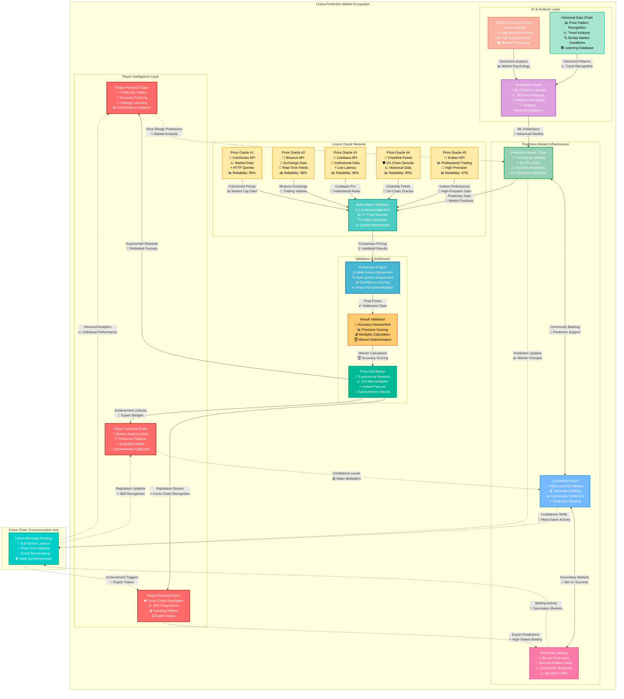

# Price Range Prediction 🎯

Price Range Prediction represents the most sophisticated and skill-intensive game mode in CoinDrafts, leveraging Linera's advanced oracle capabilities and consensus mechanisms to create a prediction market where precision and market analysis expertise are rewarded exponentially.

## Core Prediction Mechanics

### Fundamental Parameters

- **Duration**: 7 days (prediction window)
- **Challenge Type**: Exact price range forecasting
- **Entry Fee**: $1 POL (with dynamic multipliers up to 20x)
- **Validation**: Multi-source oracle consensus
- **Rewards**: Exponential scaling based on accuracy and difficulty
- **Skills Required**: Technical analysis, market sentiment, fundamental analysis

### Prediction Architecture



## Implementation Architecture

### Prediction Market Chain Structure

```rust
use linera_sdk::{
    base::{AccountOwner, Timestamp, Amount, ChainId},
    views::{LogView, MapView, RegisterView, RootView, ViewStorageContext},
    Contract, Service,
};

#[derive(RootView)]
#[view(context = ViewStorageContext)]
pub struct PredictionMarketChain {
    /// Market configuration and target cryptocurrency
    pub market_config: RegisterView<PredictionMarketConfig>,

    /// All player predictions with detailed analysis
    pub predictions: MapView<AccountOwner, PriceRangePrediction>,

    /// Confidence pools for meta-gaming opportunities
    pub confidence_pools: MapView<PriceRange, ConfidencePool>,

    /// AI-generated market analysis and insights
    pub ai_insights: RegisterView<AIMarketAnalysis>,

    /// Multi-source price validation system
    pub price_validators: MapView<OracleSource, PriceValidation>,

    /// Dynamic difficulty metrics and rewards
    pub difficulty_metrics: RegisterView<DifficultyMetrics>,

    /// Historical prediction accuracy tracking
    pub accuracy_history: LogView<PredictionAccuracyRecord>,

    /// Market sentiment and external factor analysis
    pub sentiment_data: RegisterView<MarketSentimentAnalysis>,

    /// Secondary betting on predictions
    pub meta_betting: MapView<PredictionID, MetaBettingPool>,
}

#[derive(Debug, Clone, Serialize, Deserialize, async_graphql::SimpleObject)]
pub struct PriceRangePrediction {
    pub prediction_id: String,
    pub player: AccountOwner,
    pub target_crypto: String,
    pub predicted_range: PriceRange,
    pub confidence_level: f64,
    pub reasoning: DetailedAnalysis,
    pub stake_multiplier: f64,
    pub submission_time: Timestamp,
    pub ai_assistance_used: AIAssistanceLevel,
    pub market_conditions_at_submission: MarketSnapshot,
    pub technical_analysis: Option<TechnicalAnalysisData>,
    pub fundamental_analysis: Option<FundamentalAnalysisData>,
}

#[derive(Debug, Clone, Serialize, Deserialize)]
pub struct PriceRange {
    pub min_price: Amount,
    pub max_price: Amount,
    pub range_width: Amount,
    pub difficulty_score: f64,
    pub confidence_interval: f64, // Statistical confidence level
    pub time_decay_factor: f64,   // Decreases as prediction ages
}

#[derive(Debug, Clone, Serialize, Deserialize)]
pub struct DetailedAnalysis {
    pub primary_reasoning: String,
    pub supporting_factors: Vec<String>,
    pub risk_factors: Vec<String>,
    pub market_catalysts: Vec<MarketCatalyst>,
    pub technical_indicators: Vec<TechnicalIndicator>,
    pub sentiment_analysis: SentimentAnalysis,
    pub comparable_patterns: Vec<HistoricalPattern>,
}

#[derive(Debug, Clone, Serialize, Deserialize)]
pub struct ConfidencePool {
    pub range: PriceRange,
    pub total_confidence_stake: Amount,
    pub participant_count: u32,
    pub average_confidence: f64,
    pub confidence_distribution: HashMap<ConfidenceLevel, u32>,
    pub meta_bets: Vec<MetaBet>, // Other players betting on this prediction's success
    pub ai_consensus: Option<AIConfidenceAssessment>,
}

#[derive(Debug, Clone, Serialize, Deserialize)]
pub enum AIAssistanceLevel {
    None,                    // No AI assistance used
    Basic,                   // Basic market data and trends
    Advanced,                // Technical analysis assistance
    Comprehensive,           // Full AI analysis suite
    AIGenerated,            // Completely AI-generated prediction
}
```

### Advanced Oracle Validation System

```rust
impl PredictionMarketContract {
    /// Multi-source price validation with consensus mechanism
    async fn validate_final_price(
        &mut self,
        target_crypto: String,
        prediction_end_time: Timestamp,
    ) -> Result<ValidationResult, ContractError> {
        // Query all available price sources simultaneously
        let oracle_queries = vec![
            self.query_primary_oracle(&target_crypto, prediction_end_time),
            self.query_coingecko_api(&target_crypto, prediction_end_time),
            self.query_binance_api(&target_crypto, prediction_end_time),
            self.query_coinbase_api(&target_crypto, prediction_end_time),
            self.query_kraken_api(&target_crypto, prediction_end_time),
            self.query_chainlink_feed(&target_crypto, prediction_end_time),
            self.query_band_protocol(&target_crypto, prediction_end_time),
        ];

        // Execute all queries in parallel with timeout
        let query_results = futures::try_join_all(oracle_queries).await?;

        // Filter out failed queries and outliers
        let valid_prices = self.filter_valid_prices(query_results)?;

        if valid_prices.len() < 3 {
            return Ok(ValidationResult::InsufficientData {
                sources_available: valid_prices.len(),
                minimum_required: 3,
                retry_after: Duration::hours(1),
            });
        }

        // Apply advanced consensus algorithm
        let consensus_result = self.calculate_advanced_consensus(&valid_prices)?;

        // Validate consensus quality
        let quality_assessment = self.assess_consensus_quality(&valid_prices, &consensus_result);

        if quality_assessment.confidence < 0.95 {
            return Ok(ValidationResult::RequiresExtendedValidation {
                current_consensus: consensus_result,
                confidence: quality_assessment.confidence,
                outlier_count: quality_assessment.outliers.len(),
                retry_after: Duration::minutes(30),
            });
        }

        // Store validation result for transparency
        let validation_record = PriceValidationRecord {
            crypto: target_crypto,
            timestamp: prediction_end_time,
            consensus_price: consensus_result,
            sources_used: valid_prices.len(),
            confidence: quality_assessment.confidence,
            validation_method: ConsensusMethod::WeightedMedian,
            outliers_excluded: quality_assessment.outliers,
        };

        self.accuracy_history.push(PredictionAccuracyRecord {
            validation: validation_record.clone(),
            predictions_validated: self.predictions.len(),
            timestamp: self.runtime.current_timestamp(),
        });

        Ok(ValidationResult::Validated {
            final_price: consensus_result,
            validation_record,
        })
    }

    /// Advanced consensus algorithm with outlier detection
    fn calculate_advanced_consensus(
        &self,
        valid_prices: &[PriceSource],
    ) -> Result<Amount, ContractError> {
        // Sort prices for median calculation
        let mut prices: Vec<Amount> = valid_prices.iter().map(|source| source.price).collect();
        prices.sort();

        // Calculate various consensus metrics
        let median = self.calculate_median(&prices);
        let mean = self.calculate_weighted_mean(valid_prices);
        let trimmed_mean = self.calculate_trimmed_mean(&prices, 0.1); // Remove 10% outliers

        // Weight different methods based on source reliability
        let source_reliability_weights = self.calculate_source_reliability_weights(valid_prices);
        let reliability_weighted_mean = self.calculate_reliability_weighted_mean(
            valid_prices,
            &source_reliability_weights
        );

        // Combine methods with preference for stability
        let consensus_components = vec![
            (median, 0.4),                       // 40% weight to median (stable)
            (reliability_weighted_mean, 0.3),    // 30% weight to reliability-weighted
            (trimmed_mean, 0.2),                 // 20% weight to trimmed mean
            (mean, 0.1),                         // 10% weight to simple mean
        ];

        let weighted_consensus = consensus_components
            .iter()
            .map(|(price, weight)| price.multiply_by_float(*weight))
            .fold(Amount::zero(), |acc, price| acc.add(price));

        Ok(weighted_consensus)
    }

    /// Query CoinGecko API with retry logic and rate limiting
    async fn query_coingecko_api(
        &self,
        crypto: &str,
        timestamp: Timestamp,
    ) -> Result<PriceSource, OracleError> {
        let coingecko_id = self.get_coingecko_id(crypto)?;

        // Convert timestamp to CoinGecko format
        let date_str = timestamp.to_date_string(); // Format: "dd-mm-yyyy"

        let url = format!(
            "https://api.coingecko.com/api/v3/coins/{}/history?date={}&localization=false",
            coingecko_id, date_str
        );

        // Implement retry logic with exponential backoff
        let mut retry_count = 0;
        const MAX_RETRIES: u32 = 3;

        while retry_count < MAX_RETRIES {
            match self.runtime.http_query(&url).await {
                Ok(response) => {
                    let price_data: CoinGeckoHistoricalResponse = serde_json::from_str(&response)?;

                    return Ok(PriceSource {
                        source: "coingecko".to_string(),
                        price: Amount::from_str(&price_data.market_data.current_price.usd.to_string())?,
                        timestamp,
                        confidence: 0.95,
                        reliability_score: self.get_source_reliability("coingecko"),
                        api_response_time: self.measure_response_time().await?,
                    });
                }
                Err(e) => {
                    retry_count += 1;
                    if retry_count < MAX_RETRIES {
                        // Exponential backoff
                        let delay = Duration::seconds(2_u64.pow(retry_count));
                        self.runtime.sleep(delay).await?;
                    } else {
                        return Err(OracleError::APIQueryFailed {
                            source: "coingecko".to_string(),
                            error: e.to_string(),
                            retries_attempted: retry_count,
                        });
                    }
                }
            }
        }

        Err(OracleError::MaxRetriesExceeded)
    }

    /// Query Chainlink price feed with fallback mechanisms
    async fn query_chainlink_feed(
        &self,
        crypto: &str,
        timestamp: Timestamp,
    ) -> Result<PriceSource, OracleError> {
        let feed_address = self.get_chainlink_feed_address(crypto)?;

        // Query historical price from Chainlink
        let price_result = self.runtime.call_contract(
            feed_address,
            "getRoundData",
            vec![timestamp.to_round_id()],
        ).await?;

        let (round_id, price, started_at, updated_at, answered_in_round) = price_result;

        // Validate timestamp proximity
        let time_diff = timestamp.duration_since(Timestamp::from_nanoseconds_since_epoch(updated_at));
        if time_diff > Duration::hours(1) {
            return Err(OracleError::TimestampMismatch {
                requested: timestamp,
                available: Timestamp::from_nanoseconds_since_epoch(updated_at),
                difference: time_diff,
            });
        }

        Ok(PriceSource {
            source: "chainlink".to_string(),
            price: Amount::from_u64(price),
            timestamp: Timestamp::from_nanoseconds_since_epoch(updated_at),
            confidence: 0.98, // Chainlink is highly reliable
            reliability_score: self.get_source_reliability("chainlink"),
            api_response_time: Duration::milliseconds(50), // On-chain calls are fast
        })
    }
}
```

## Dynamic Difficulty & Reward System

### Exponential Reward Scaling

```rust
impl PredictionMarketContract {
    /// Calculate prediction multiplier based on difficulty and accuracy
    async fn calculate_prediction_multiplier(
        &self,
        prediction: &PriceRangePrediction,
        actual_price: Amount,
    ) -> Result<f64, ContractError> {
        // Base multiplier from range difficulty (smaller range = higher reward)
        let range_width = prediction.predicted_range.range_width.as_u64();
        let target_price = prediction.predicted_range.min_price.add(
            prediction.predicted_range.range_width.divide_by_int(2)
        ); // Midpoint of predicted range

        let range_difficulty_multiplier = match range_width {
            0..=50 => 20.0,       // $50 range = 20x (extremely difficult)
            51..=100 => 15.0,     // $100 range = 15x (very difficult)
            101..=250 => 10.0,    // $250 range = 10x (difficult)
            251..=500 => 5.0,     // $500 range = 5x (moderate)
            501..=1000 => 2.5,    // $1000 range = 2.5x (easy)
            1001..=2000 => 1.5,   // $2000 range = 1.5x (very easy)
            _ => 1.0,             // >$2000 range = 1x (too easy)
        };

        // Accuracy bonus (exponential scaling for precision)
        let accuracy_bonus = self.calculate_accuracy_bonus(prediction, actual_price).await?;

        // Confidence level multiplier
        let confidence_multiplier = 1.0 + (prediction.confidence_level * 0.5);

        // Market volatility adjustment (higher volatility = higher rewards)
        let volatility_multiplier = self.calculate_volatility_multiplier(
            &prediction.target_crypto,
            prediction.submission_time
        ).await?;

        // AI assistance penalty
        let ai_penalty = match prediction.ai_assistance_used {
            AIAssistanceLevel::None => 1.0,
            AIAssistanceLevel::Basic => 0.9,
            AIAssistanceLevel::Advanced => 0.8,
            AIAssistanceLevel::Comprehensive => 0.7,
            AIAssistanceLevel::AIGenerated => 0.5,
        };

        // Time decay bonus (earlier predictions get bonus)
        let time_bonus = self.calculate_time_submission_bonus(prediction.submission_time);

        // Market condition difficulty bonus
        let market_difficulty_bonus = self.calculate_market_difficulty_bonus(
            &prediction.market_conditions_at_submission
        );

        // Calculate final multiplier
        let final_multiplier = range_difficulty_multiplier
            * accuracy_bonus
            * confidence_multiplier
            * volatility_multiplier
            * ai_penalty
            * time_bonus
            * market_difficulty_bonus;

        // Cap maximum multiplier to prevent extreme payouts
        Ok(final_multiplier.min(100.0))
    }

    /// Calculate accuracy bonus with exponential scaling
    async fn calculate_accuracy_bonus(
        &self,
        prediction: &PriceRangePrediction,
        actual_price: Amount,
    ) -> Result<f64, ContractError> {
        let min_price = prediction.predicted_range.min_price;
        let max_price = prediction.predicted_range.max_price;

        // Check if prediction was accurate (within range)
        if actual_price >= min_price && actual_price <= max_price {
            // Perfect prediction - within range
            let range_center = min_price.add(max_price).divide_by_int(2);
            let distance_from_center = if actual_price > range_center {
                actual_price.subtract(range_center)
            } else {
                range_center.subtract(actual_price)
            };

            let range_radius = max_price.subtract(min_price).divide_by_int(2);
            let accuracy_ratio = 1.0 - (distance_from_center.as_f64() / range_radius.as_f64());

            // Exponential scaling for precision within range
            let accuracy_bonus = 1.0 + (accuracy_ratio * accuracy_ratio * 5.0); // Up to 6x for perfect center

            Ok(accuracy_bonus)
        } else {
            // Prediction was wrong - no bonus, but check how close
            let distance_from_range = if actual_price < min_price {
                min_price.subtract(actual_price)
            } else {
                actual_price.subtract(max_price)
            };

            let range_width = max_price.subtract(min_price);
            let miss_ratio = distance_from_range.as_f64() / range_width.as_f64();

            // Partial credit for near misses (up to 20% of range width)
            if miss_ratio <= 0.2 {
                let partial_credit = 0.5 * (1.0 - miss_ratio * 5.0); // Linear decay to 0
                Ok(partial_credit.max(0.1)) // Minimum 0.1x for close attempts
            } else {
                Ok(0.0) // No bonus for predictions far from actual price
            }
        }
    }

    /// Calculate market volatility multiplier
    async fn calculate_volatility_multiplier(
        &self,
        crypto: &str,
        submission_time: Timestamp,
    ) -> Result<f64, ContractError> {
        // Get historical volatility at time of prediction
        let volatility_data = self.get_historical_volatility(crypto, submission_time).await?;

        // Higher volatility = higher difficulty = higher multiplier
        let volatility_multiplier = match volatility_data.seven_day_volatility {
            vol if vol > 0.50 => 3.0,    // >50% volatility = 3x
            vol if vol > 0.30 => 2.0,    // >30% volatility = 2x
            vol if vol > 0.20 => 1.5,    // >20% volatility = 1.5x
            vol if vol > 0.10 => 1.2,    // >10% volatility = 1.2x
            _ => 1.0,                    // Low volatility = 1x
        };

        Ok(volatility_multiplier)
    }

    /// Calculate time submission bonus (early submissions get rewarded)
    fn calculate_time_submission_bonus(&self, submission_time: Timestamp) -> f64 {
        let market_config = self.market_config.get();
        let prediction_window = market_config.end_time.duration_since(market_config.start_time);
        let time_until_end = market_config.end_time.duration_since(submission_time);

        let time_remaining_ratio = time_until_end.as_secs_f64() / prediction_window.as_secs_f64();

        // Bonus for early submissions
        match time_remaining_ratio {
            ratio if ratio > 0.8 => 1.3,  // Submitted in first 20% = 1.3x bonus
            ratio if ratio > 0.6 => 1.2,  // Submitted in first 40% = 1.2x bonus
            ratio if ratio > 0.4 => 1.1,  // Submitted in first 60% = 1.1x bonus
            _ => 1.0,                      // Late submissions = no bonus
        }
    }
}
```

## AI-Powered Market Analysis

### Comprehensive Analysis Engine

```rust
#[derive(RootView)]
#[view(context = ViewStorageContext)]
pub struct AIMarketAnalysisChain {
    /// Real-time market data aggregation
    pub market_data: MapView<String, RealTimeMarketData>,

    /// Technical analysis models and indicators
    pub technical_models: MapView<String, TechnicalAnalysisModel>,

    /// Fundamental analysis scoring
    pub fundamental_scores: MapView<String, FundamentalAnalysisScore>,

    /// Sentiment analysis from multiple sources
    pub sentiment_analysis: MapView<String, SentimentAnalysisData>,

    /// Machine learning prediction models
    pub ml_models: MapView<String, MLPredictionModel>,

    /// Historical pattern recognition
    pub pattern_library: LogView<HistoricalPattern>,

    /// Market correlation analysis
    pub correlation_matrix: RegisterView<MarketCorrelationMatrix>,
}

impl AIMarketAnalysisContract {
    /// Generate comprehensive market analysis for prediction assistance
    async fn generate_comprehensive_analysis(
        &mut self,
        crypto: String,
        prediction_timeframe: Duration,
    ) -> Result<ComprehensiveMarketAnalysis, ContractError> {
        // Parallel data gathering from multiple sources
        let (
            market_data,
            technical_analysis,
            fundamental_analysis,
            sentiment_data,
            on_chain_metrics,
            derivatives_data,
            macro_economic_data,
        ) = futures::try_join!(
            self.gather_real_time_market_data(&crypto),
            self.perform_technical_analysis(&crypto, prediction_timeframe),
            self.analyze_fundamental_factors(&crypto),
            self.analyze_market_sentiment(&crypto),
            self.analyze_on_chain_metrics(&crypto),
            self.analyze_derivatives_markets(&crypto),
            self.gather_macro_economic_indicators()
        )?;

        // Advanced machine learning prediction
        let ml_prediction = self.run_ml_prediction_ensemble(
            &market_data,
            &technical_analysis,
            &fundamental_analysis,
            &sentiment_data,
            &on_chain_metrics,
            prediction_timeframe,
        ).await?;

        // Pattern recognition analysis
        let similar_patterns = self.find_similar_historical_patterns(
            &market_data,
            &technical_analysis,
            prediction_timeframe,
        ).await?;

        // Risk assessment
        let risk_analysis = self.calculate_comprehensive_risk_assessment(
            &market_data,
            &technical_analysis,
            &derivatives_data,
            &macro_economic_data,
        ).await?;

        // Generate price range suggestions
        let suggested_ranges = self.generate_ai_range_suggestions(
            &ml_prediction,
            &similar_patterns,
            &risk_analysis,
        ).await?;

        Ok(ComprehensiveMarketAnalysis {
            crypto,
            analysis_timestamp: self.runtime.current_timestamp(),
            prediction_timeframe,
            market_data,
            technical_analysis,
            fundamental_analysis,
            sentiment_data,
            on_chain_metrics,
            ml_prediction,
            similar_patterns,
            risk_analysis,
            suggested_ranges,
            confidence_score: self.calculate_overall_confidence(&ml_prediction, &similar_patterns),
            key_factors: self.identify_key_factors(&technical_analysis, &fundamental_analysis),
            warnings: self.generate_risk_warnings(&risk_analysis),
        })
    }

    /// Advanced technical analysis with multiple indicators
    async fn perform_technical_analysis(
        &self,
        crypto: &str,
        timeframe: Duration,
    ) -> Result<TechnicalAnalysisData, ContractError> {
        // Get comprehensive price history
        let price_history = self.get_price_history(crypto, Duration::days(365)).await?;

        // Calculate multiple technical indicators
        let indicators = TechnicalIndicators {
            // Trend indicators
            sma_20: self.calculate_sma(&price_history, 20),
            sma_50: self.calculate_sma(&price_history, 50),
            sma_200: self.calculate_sma(&price_history, 200),
            ema_12: self.calculate_ema(&price_history, 12),
            ema_26: self.calculate_ema(&price_history, 26),

            // Momentum indicators
            rsi: self.calculate_rsi(&price_history, 14),
            macd: self.calculate_macd(&price_history),
            stochastic: self.calculate_stochastic(&price_history, 14),

            // Volatility indicators
            bollinger_bands: self.calculate_bollinger_bands(&price_history, 20, 2.0),
            atr: self.calculate_atr(&price_history, 14),

            // Volume indicators
            obv: self.calculate_obv(&price_history),
            volume_sma: self.calculate_volume_sma(&price_history, 20),

            // Support and resistance
            support_levels: self.identify_support_levels(&price_history),
            resistance_levels: self.identify_resistance_levels(&price_history),

            // Pattern recognition
            chart_patterns: self.identify_chart_patterns(&price_history),
            candlestick_patterns: self.identify_candlestick_patterns(&price_history),
        };

        // Analyze indicator convergence/divergence
        let signal_analysis = self.analyze_indicator_signals(&indicators);

        // Generate technical forecast
        let technical_forecast = self.generate_technical_forecast(
            &indicators,
            &signal_analysis,
            timeframe,
        );

        Ok(TechnicalAnalysisData {
            indicators,
            signal_analysis,
            technical_forecast,
            overall_trend: self.determine_overall_trend(&indicators),
            strength: self.calculate_trend_strength(&indicators),
            reliability_score: self.calculate_technical_reliability(&signal_analysis),
        })
    }

    /// Fundamental analysis with comprehensive metrics
    async fn analyze_fundamental_factors(&self, crypto: &str) -> Result<FundamentalAnalysisScore, ContractError> {
        // Gather fundamental data from multiple sources
        let fundamental_data = FundamentalData {
            // Network metrics
            active_addresses: self.get_active_addresses(crypto).await?,
            transaction_volume: self.get_transaction_volume(crypto).await?,
            hash_rate: self.get_hash_rate(crypto).await?,
            network_value_to_transactions: self.calculate_nvt_ratio(crypto).await?,

            // Token economics
            circulating_supply: self.get_circulating_supply(crypto).await?,
            total_supply: self.get_total_supply(crypto).await?,
            inflation_rate: self.calculate_inflation_rate(crypto).await?,
            token_velocity: self.calculate_token_velocity(crypto).await?,

            // Development activity
            github_commits: self.get_github_activity(crypto).await?,
            developer_count: self.get_developer_count(crypto).await?,

            // Adoption metrics
            exchange_listings: self.get_exchange_listings(crypto).await?,
            partnership_announcements: self.get_partnerships(crypto).await?,
            institutional_adoption: self.get_institutional_holdings(crypto).await?,

            // Financial metrics
            market_cap: self.get_market_cap(crypto).await?,
            trading_volume_24h: self.get_24h_volume(crypto).await?,
            liquidity_metrics: self.calculate_liquidity_metrics(crypto).await?,
        };

        // Calculate comprehensive fundamental score
        let fundamental_score = self.calculate_fundamental_score(&fundamental_data);

        Ok(FundamentalAnalysisScore {
            overall_score: fundamental_score,
            category_scores: self.calculate_category_scores(&fundamental_data),
            strengths: self.identify_fundamental_strengths(&fundamental_data),
            weaknesses: self.identify_fundamental_weaknesses(&fundamental_data),
            outlook: self.generate_fundamental_outlook(&fundamental_data),
            data: fundamental_data,
        })
    }

    /// Multi-source sentiment analysis
    async fn analyze_market_sentiment(&self, crypto: &str) -> Result<SentimentAnalysisData, ContractError> {
        // Gather sentiment data from multiple sources
        let (
            social_sentiment,
            news_sentiment,
            options_sentiment,
            funding_rates,
            fear_greed_index,
        ) = futures::try_join!(
            self.analyze_social_media_sentiment(crypto),
            self.analyze_news_sentiment(crypto),
            self.analyze_options_sentiment(crypto),
            self.get_funding_rates(crypto),
            self.get_fear_greed_index()
        )?;

        // Combine sentiment signals
        let combined_sentiment = self.combine_sentiment_signals(
            &social_sentiment,
            &news_sentiment,
            &options_sentiment,
            &funding_rates,
            &fear_greed_index,
        );

        Ok(SentimentAnalysisData {
            overall_sentiment: combined_sentiment,
            social_sentiment,
            news_sentiment,
            options_sentiment,
            funding_rates,
            fear_greed_index,
            sentiment_trend: self.calculate_sentiment_trend(crypto).await?,
            contrarian_signals: self.identify_contrarian_signals(&combined_sentiment),
        })
    }
}
```

## Confidence Pools & Meta-Gaming

### Secondary Prediction Markets

```rust
impl PredictionMarketContract {
    /// Create confidence pools for meta-gaming opportunities
    async fn create_confidence_pools(
        &mut self,
        prediction: &PriceRangePrediction,
    ) -> Result<(), ContractError> {
        let range_key = prediction.predicted_range.clone();

        // Create or update confidence pool for this prediction range
        let mut pool = self.confidence_pools.get(&range_key).unwrap_or_default();

        // Add the main prediction to the pool
        pool.add_primary_prediction(
            prediction.player,
            prediction.confidence_level,
            prediction.stake_multiplier,
            prediction.reasoning.clone(),
        );

        // Enable meta-betting on this prediction's success
        pool.open_for_meta_betting(Duration::days(5)); // Allow betting until 2 days before end

        // AI confidence assessment
        let ai_assessment = self.generate_ai_confidence_assessment(prediction).await?;
        pool.ai_consensus = Some(ai_assessment);

        self.confidence_pools.insert(&range_key, pool).await?;

        // Publish event for potential meta-bettors
        self.runtime.publish_event(PredictionEvent::ConfidencePoolCreated {
            prediction_id: prediction.prediction_id.clone(),
            range: prediction.predicted_range.clone(),
            confidence: prediction.confidence_level,
            ai_assessment: pool.ai_consensus.clone(),
            meta_betting_deadline: self.runtime.current_timestamp() + Duration::days(5),
        }).await?;

        Ok(())
    }

    /// Allow other players to bet on prediction success (meta-gaming)
    async fn place_meta_bet(
        &mut self,
        meta_bettor: AccountOwner,
        prediction_id: String,
        bet_amount: Amount,
        bet_type: MetaBetType,
    ) -> Result<(), ContractError> {
        // Validate meta-bettor is not the original predictor
        let prediction = self.predictions.values()
            .find(|p| p.prediction_id == prediction_id)
            .ok_or(ContractError::PredictionNotFound)?;

        if prediction.player == meta_bettor {
            return Err(ContractError::CannotBetOnOwnPrediction);
        }

        // Find the confidence pool
        let mut pool = self.confidence_pools.get(&prediction.predicted_range)
            .ok_or(ContractError::ConfidencePoolNotFound)?;

        // Validate betting is still open
        if self.runtime.current_timestamp() > pool.meta_betting_deadline {
            return Err(ContractError::MetaBettingClosed);
        }

        // Transfer bet amount to contract
        self.runtime.transfer_from(meta_bettor, bet_amount).await?;

        // Create meta bet
        let meta_bet = MetaBet {
            bettor: meta_bettor,
            amount: bet_amount,
            bet_type,
            timestamp: self.runtime.current_timestamp(),
            odds: self.calculate_meta_bet_odds(&pool, &bet_type),
        };

        // Add to meta betting pool
        pool.meta_bets.push(meta_bet.clone());
        pool.total_meta_betting_amount = pool.total_meta_betting_amount.add(bet_amount);

        self.confidence_pools.insert(&prediction.predicted_range, pool).await?;

        // Notify meta-bettor
        self.runtime.send_message(
            meta_bettor,
            PlayerMessage::MetaBetPlaced {
                prediction_id,
                bet_amount,
                bet_type,
                potential_payout: self.calculate_potential_meta_payout(&meta_bet),
            }
        ).await?;

        Ok(())
    }

    /// Calculate dynamic odds for meta-betting
    fn calculate_meta_bet_odds(&self, pool: &ConfidencePool, bet_type: &MetaBetType) -> f64 {
        match bet_type {
            MetaBetType::WillSucceed => {
                // Odds based on confidence level and AI assessment
                let base_odds = 1.0 / pool.average_confidence.max(0.1);
                let ai_adjustment = if let Some(ai_consensus) = &pool.ai_consensus {
                    1.0 / ai_consensus.success_probability.max(0.1)
                } else {
                    1.0
                };

                // Combine with market sentiment
                let market_adjustment = self.get_market_sentiment_adjustment();

                (base_odds * ai_adjustment * market_adjustment).max(1.1).min(10.0)
            }

            MetaBetType::WillFail => {
                // Inverse of success odds
                let success_odds = self.calculate_meta_bet_odds(pool, &MetaBetType::WillSucceed);
                (1.0 / (1.0 - (1.0 / success_odds))).max(1.1).min(10.0)
            }

            MetaBetType::WillBeClose => {
                // Betting that prediction will be close but not exact
                2.5 // Fixed odds for close misses
            }
        }
    }
}

#[derive(Debug, Clone, Serialize, Deserialize)]
pub enum MetaBetType {
    WillSucceed,    // Bet that the prediction will be accurate
    WillFail,       // Bet that the prediction will be wrong
    WillBeClose,    // Bet that prediction will be close but not exact
}

#[derive(Debug, Clone, Serialize, Deserialize)]
pub struct MetaBet {
    pub bettor: AccountOwner,
    pub amount: Amount,
    pub bet_type: MetaBetType,
    pub timestamp: Timestamp,
    pub odds: f64,
}
```

## Prize Distribution & Validation

### Final Settlement Process

```rust
impl PredictionMarketContract {
    /// Settle all predictions and distribute prizes
    async fn settle_prediction_market(&mut self) -> Result<SettlementResult, ContractError> {
        let market_config = self.market_config.get();

        // Validate final price with multi-oracle consensus
        let validation_result = self.validate_final_price(
            market_config.target_crypto.clone(),
            market_config.end_time,
        ).await?;

        let final_price = match validation_result {
            ValidationResult::Validated { final_price, .. } => final_price,
            ValidationResult::RequiresExtendedValidation { .. } => {
                // Extend settlement period and retry
                return Ok(SettlementResult::DelayedSettlement {
                    reason: "Awaiting additional price validation".to_string(),
                    retry_after: Duration::hours(1),
                });
            }
            ValidationResult::InsufficientData { .. } => {
                return Err(ContractError::InsufficientPriceData);
            }
        };

        // Evaluate all predictions
        let mut prediction_results = Vec::new();
        let mut total_payout = Amount::zero();

        for (player, prediction) in self.predictions.iter() {
            let result = self.evaluate_prediction(prediction, final_price).await?;

            if result.is_successful {
                // Calculate payout with multipliers
                let multiplier = self.calculate_prediction_multiplier(prediction, final_price).await?;
                let base_payout = market_config.entry_fee;
                let final_payout = base_payout.multiply_by_float(multiplier);

                // Transfer prize to player
                self.runtime.transfer(*player, final_payout).await?;
                total_payout = total_payout.add(final_payout);

                // Update player's personal chain
                self.runtime.send_message(
                    *player,
                    PlayerMessage::PredictionSuccess {
                        prediction_id: prediction.prediction_id.clone(),
                        accuracy: result.accuracy_score,
                        multiplier,
                        payout: final_payout,
                        final_price,
                    }
                ).await?;

                prediction_results.push(PredictionResult {
                    player: *player,
                    prediction: prediction.clone(),
                    result: result.clone(),
                    payout: Some(final_payout),
                    multiplier,
                });
            } else {
                // Unsuccessful prediction - no payout but store result
                self.runtime.send_message(
                    *player,
                    PlayerMessage::PredictionFailure {
                        prediction_id: prediction.prediction_id.clone(),
                        final_price,
                        predicted_range: prediction.predicted_range.clone(),
                        miss_distance: result.miss_distance,
                    }
                ).await?;

                prediction_results.push(PredictionResult {
                    player: *player,
                    prediction: prediction.clone(),
                    result: result.clone(),
                    payout: None,
                    multiplier: 0.0,
                });
            }
        }

        // Settle meta-betting pools
        let meta_betting_results = self.settle_meta_betting_pools(final_price).await?;

        // Update global statistics
        self.update_global_prediction_statistics(&prediction_results).await?;

        // Publish settlement event
        self.runtime.publish_event(PredictionEvent::MarketSettled {
            target_crypto: market_config.target_crypto,
            final_price,
            total_predictions: prediction_results.len(),
            successful_predictions: prediction_results.iter().filter(|r| r.result.is_successful).count(),
            total_payouts: total_payout,
            highest_multiplier: prediction_results.iter()
                .map(|r| r.multiplier)
                .fold(0.0, f64::max),
        }).await?;

        Ok(SettlementResult::Completed {
            final_price,
            prediction_results,
            meta_betting_results,
            total_payouts: total_payout,
        })
    }

    /// Settle all meta-betting pools
    async fn settle_meta_betting_pools(
        &mut self,
        final_price: Amount,
    ) -> Result<Vec<MetaBettingResult>, ContractError> {
        let mut meta_results = Vec::new();

        for (range, pool) in self.confidence_pools.iter() {
            // Determine if the primary prediction was successful
            let prediction_successful = final_price >= range.min_price && final_price <= range.max_price;

            // Distribute meta-betting payouts
            for meta_bet in &pool.meta_bets {
                let won_bet = match meta_bet.bet_type {
                    MetaBetType::WillSucceed => prediction_successful,
                    MetaBetType::WillFail => !prediction_successful,
                    MetaBetType::WillBeClose => {
                        // Check if price was close (within 20% of range width)
                        let range_width = range.max_price.subtract(range.min_price);
                        let threshold = range_width.multiply_by_float(0.2);

                        if prediction_successful {
                            false // Can't be "close" if it was exactly right
                        } else {
                            let distance = if final_price < range.min_price {
                                range.min_price.subtract(final_price)
                            } else {
                                final_price.subtract(range.max_price)
                            };
                            distance <= threshold
                        }
                    }
                };

                if won_bet {
                    let payout = meta_bet.amount.multiply_by_float(meta_bet.odds);
                    self.runtime.transfer(meta_bet.bettor, payout).await?;

                    meta_results.push(MetaBettingResult {
                        bettor: meta_bet.bettor,
                        bet_amount: meta_bet.amount,
                        payout: Some(payout),
                        bet_type: meta_bet.bet_type.clone(),
                        won: true,
                    });
                } else {
                    meta_results.push(MetaBettingResult {
                        bettor: meta_bet.bettor,
                        bet_amount: meta_bet.amount,
                        payout: None,
                        bet_type: meta_bet.bet_type.clone(),
                        won: false,
                    });
                }
            }
        }

        Ok(meta_results)
    }
}
```

Price Range Prediction represents the pinnacle of skill-based cryptocurrency gaming, where market expertise, analytical ability, and intuition converge in a sophisticated prediction market. By leveraging Linera's advanced oracle capabilities, consensus mechanisms, and real-time processing, it creates an environment where the most skilled market analysts can earn substantial rewards proportional to their precision and courage.

The exponential reward scaling, multi-source validation, and meta-gaming opportunities create a rich ecosystem that rewards both primary prediction skills and secondary market analysis abilities. This game mode transforms cryptocurrency price prediction from simple speculation into a sophisticated skill-based competition.

---

_Where precision meets profit, powered by Linera's oracle revolution_ 🎯💎
