# Quick Match ⚡

Quick Match represents the fastest, most accessible entry point into CoinDrafts, leveraging Linera's ultra-low latency capabilities to deliver 24-hour lightning-fast cryptocurrency competitions. Perfect for casual gamers and rapid engagement.

## Quick Match Fundamentals

### Core Parameters

- **Duration**: 24 hours (rolling start times)
- **Portfolio Size**: 3 cryptocurrency selections (streamlined)
- **Entry Fee**: $0.50 USDC (50% lower barrier)
- **Maximum Participants**: Unlimited (auto-scaling chains)
- **Updates**: Every 30 seconds (ultra-responsive)
- **Scoring**: Performance-based with speed bonuses

### Architecture Overview

```mermaid
graph TB
    subgraph "Linera Quick Match Ecosystem"
        subgraph "Player Sovereignty"
            PC1[Player Personal Chain<br/>💎 Individual Ownership<br/>📊 Performance Tracking<br/>⚡ Zero-Cost Reads]
            PC2[Player Personal Chain<br/>🏃 Speed Bonus History<br/>🎯 Quick Match Preferences<br/>📈 Rapid Decision Analytics]
            PCN[Player Personal Chain<br/>🤖 AI Learning Profile<br/>🏅 Achievement Collection<br/>🌐 Cross-Chain Reputation]
        end

        subgraph "Quick Match Infrastructure"
            QMR[Quick Match Registry<br/>🎮 Match Orchestration<br/>⚡ 24-Hour Lifecycle<br/>🔄 Auto-Scaling]
            QM1[Active Quick Match #1<br/>⚡ 24-Hour Competition<br/>🎯 3 Cryptocurrency Portfolio<br/>💸 $0.50 USDC Entry<br/>👥 Live Participants]
            QM2[Active Quick Match #2<br/>🏃 Speed Bonus System<br/>📊 Real-Time Rankings<br/>⏰ Auto-Finalization<br/>🎉 Instant Rewards]
            QMN[Active Quick Match #N<br/>🔄 Parallel Processing<br/>♾️ Unlimited Scaling<br/>🗑️ Auto-Cleanup<br/>📈 Performance Metrics]
        end

        subgraph "Linera Oracle Network"
            SO[Speed Oracle Chain<br/>📈 30-Second Price Updates<br/>⚡ Ultra-Low Latency<br/>🔄 Rapid Data Processing<br/>📊 Volatility Tracking]
            AI[AI Quick Analysis<br/>🧠 Rapid Strategy Models<br/>⚡ 3-Crypto Optimization<br/>🎯 Quick Decision Support<br/>💡 Real-Time Insights]
        end

        subgraph "Social & Spectator Layer"
            SS[Spectator Stream Network<br/>👀 Live Match Viewing<br/>📺 Real-Time Commentary<br/>🎬 AI Match Analysis<br/>💬 Community Engagement]
            ES[Event Stream Hub<br/>📡 Achievement Broadcasts<br/>🏆 Victory Celebrations<br/>⚡ Speed Bonus Alerts<br/>🎉 Social Sharing]
        end

        subgraph "Infrastructure Services"
            ACS[Auto-Cleanup Service<br/>🗑️ 24-Hour Chain Expiry<br/>♻️ Resource Recycling<br/>📊 Analytics Archival<br/>🔄 State Management]
            PD[Prize Distribution<br/>💰 Instant Payouts<br/>🏆 Tier-Based Rewards<br/>⚡ Speed Bonuses<br/>📈 Performance Multipliers]
        end
    end

    subgraph "Cross-Chain Communication"
        CCM[Linera Message Passing<br/>⚡ Sub-500ms Updates<br/>🔄 Real-Time Sync<br/>📨 Event Broadcasting<br/>🌐 Global Coordination]
    end

    %% Personal Chain Connections
    PC1 -.->|Quick Portfolio Submission<br/>⚡ 3-Crypto Selection| QM1
    PC2 -.->|Rapid Participation<br/>🏃 Speed Optimization| QM2
    PCN -.->|Parallel Competition<br/>♾️ Unlimited Access| QMN

    %% Registry Orchestration
    QMR -->|Match Creation<br/>🎮 Instance Management| QM1
    QMR -->|Load Balancing<br/>⚖️ Player Distribution| QM2
    QMR -->|Scaling Control<br/>📈 Capacity Management| QMN

    %% Oracle Data Distribution
    SO -->|Lightning Price Feeds<br/>⚡ 30-Second Updates| QM1
    SO -->|Market Volatility<br/>📊 Risk Assessment| QM2
    SO -->|Performance Metrics<br/>📈 Real-Time Tracking| QMN

    AI -->|Quick Strategies<br/>🎯 3-Crypto Analysis| PC1
    AI -->|Rapid Insights<br/>⚡ Speed Optimization| PC2
    AI -->|Pattern Recognition<br/>🔍 Historical Analysis| PCN

    %% Cross-Chain Messaging Flow
    QM1 -.->|Performance Updates<br/>📊 Portfolio Changes| CCM
    QM2 -.->|Ranking Changes<br/>🏆 Leaderboard Shifts| CCM
    QMN -.->|Match Completion<br/>🎉 Final Results| CCM

    CCM -.->|Personal Analytics<br/>📈 Individual Metrics| PC1
    CCM -.->|Speed Achievements<br/>🏃 Bonus Tracking| PC2
    CCM -.->|Cross-Match Learning<br/>🧠 AI Profile Updates| PCN

    %% Spectator & Social Integration
    SS -->|Live Commentary<br/>🎬 AI Analysis| QM1
    SS -->|Match Streaming<br/>📺 Real-Time Viewing| QM2
    SS -->|Community Features<br/>💬 Social Interaction| QMN

    ES -->|Achievement Alerts<br/>🏅 Badge Unlocks| PC1
    ES -->|Victory Announcements<br/>🏆 Win Celebrations| PC2
    ES -->|Speed Records<br/>⚡ Performance Highlights| PCN

    %% Infrastructure Services
    ACS -->|24-Hour Cleanup<br/>🗑️ Chain Expiry| QM1
    ACS -->|Resource Recovery<br/>♻️ State Archival| QM2
    ACS -->|Analytics Preservation<br/>📊 Data Mining| QMN

    PD -->|Instant Rewards<br/>💰 Immediate Payouts| PC1
    PD -->|Speed Bonuses<br/>🏃 Performance Multipliers| PC2
    PD -->|Achievement Prizes<br/>🏅 Badge Rewards| PCN

    %% Styling for Visual Hierarchy
    style PC1 fill:#ff6b6b,stroke:#c0392b,stroke-width:3px,color:#fff
    style PC2 fill:#ff6b6b,stroke:#c0392b,stroke-width:3px,color:#fff
    style PCN fill:#ff6b6b,stroke:#c0392b,stroke-width:3px,color:#fff

    style QM1 fill:#45b7d1,stroke:#2980b9,stroke-width:3px,color:#fff
    style QM2 fill:#45b7d1,stroke:#2980b9,stroke-width:3px,color:#fff
    style QMN fill:#45b7d1,stroke:#2980b9,stroke-width:3px,color:#fff

    style SO fill:#ffeaa7,stroke:#f39c12,stroke-width:2px,color:#000
    style AI fill:#dda0dd,stroke:#8e44ad,stroke-width:2px,color:#fff

    style SS fill:#74b9ff,stroke:#0984e3,stroke-width:2px,color:#fff
    style ES fill:#a8e6cf,stroke:#00b894,stroke-width:2px,color:#000

    style ACS fill:#fd79a8,stroke:#e84393,stroke-width:2px,color:#fff
    style PD fill:#fdcb6e,stroke:#e17055,stroke-width:2px,color:#000

    style CCM fill:#00cec9,stroke:#00b894,stroke-width:4px,color:#fff
```



## Implementation Architecture

### Quick Match Chain Structure

Each Quick Match operates on a lightweight, temporary microchain optimized for speed:

```rust
use linera_sdk::{
    base::{AccountOwner, Timestamp, Amount, ChainId},
    views::{LogView, MapView, RegisterView, RootView, ViewStorageContext},
    Contract, Service,
};

#[derive(RootView)]
#[view(context = ViewStorageContext)]
pub struct QuickMatchChain {
    /// Quick match configuration and rules
    pub config: RegisterView<QuickMatchConfig>,

    /// Streamlined portfolio structure (3 cryptos only)
    pub quick_portfolios: MapView<AccountOwner, QuickPortfolio>,

    /// High-frequency leaderboard with 30-second updates
    pub live_rankings: RegisterView<LiveRankings>,

    /// Spectator mode for non-participants
    pub spectators: MapView<AccountOwner, SpectatorPreferences>,

    /// Performance tracking with rapid updates
    pub performance_stream: LogView<PerformanceUpdate>,

    /// Auto-expiry and cleanup configuration
    pub expiry_time: RegisterView<Timestamp>,

    /// Prize pool with instant distribution
    pub prize_pool: RegisterView<QuickPrizePool>,

    /// Social features for rapid engagement
    pub quick_chat: LogView<QuickChatMessage>,
}

#[derive(Debug, Clone, Serialize, Deserialize, async_graphql::SimpleObject)]
pub struct QuickPortfolio {
    /// Fixed array of 3 cryptocurrency selections
    pub cryptocurrencies: [QuickCryptoSelection; 3],

    /// Submission timestamp for speed bonuses
    pub submission_time: Timestamp,

    /// Last performance update timestamp
    pub last_update: Timestamp,

    /// Current portfolio performance percentage
    pub current_performance: f64,

    /// Peak performance achieved during match
    pub peak_performance: f64,

    /// Volatility score for risk assessment
    pub volatility_score: f64,

    /// Speed bonus from quick decision making
    pub speed_bonus: f64,

    /// AI assistance usage tracking
    pub ai_assistance_used: bool,
}

#[derive(Debug, Clone, Serialize, Deserialize)]
pub struct QuickCryptoSelection {
    pub symbol: String,
    pub name: String,
    pub entry_price: Amount,
    pub current_price: Amount,
    pub performance: f64,
    pub selection_reasoning: String,
    pub confidence: f64,
}

#[derive(Debug, Clone, Serialize, Deserialize)]
pub struct QuickMatchConfig {
    pub match_id: String,
    pub start_time: Timestamp,
    pub end_time: Timestamp,
    pub entry_fee: Amount,
    pub max_participants: u32,
    pub speed_bonus_enabled: bool,
    pub ai_suggestions_allowed: bool,
    pub spectator_mode_enabled: bool,
}
```

### Ultra-Fast Price Processing Engine

```rust
impl QuickMatchContract {
    /// Process rapid price updates every 30 seconds
    async fn process_rapid_price_update(
        &mut self,
        price_update: RapidPriceUpdate,
    ) -> Result<(), ContractError> {
        let update_start = self.runtime.current_timestamp();

        // Batch process all portfolios with parallel computation
        let mut ranking_changes = Vec::new();
        let mut performance_alerts = Vec::new();

        // Process all portfolios in parallel for maximum speed
        let portfolio_futures: Vec<_> = self.quick_portfolios.iter_mut()
            .map(|(player, portfolio)| {
                let update = price_update.clone();
                async move {
                    let old_performance = portfolio.current_performance;
                    let old_rank = self.get_current_rank(*player).await?;

                    // Calculate new performance with optimized algorithm
                    let new_performance = self.calculate_quick_performance(
                        &portfolio.cryptocurrencies,
                        &update
                    )?;

                    // Update portfolio data
                    portfolio.current_performance = new_performance;
                    portfolio.last_update = update_start;

                    // Track peak performance for achievements
                    if new_performance > portfolio.peak_performance {
                        portfolio.peak_performance = new_performance;
                    }

                    // Calculate performance change magnitude
                    let performance_delta = new_performance - old_performance;

                    // Generate alerts for significant changes (>2% threshold for quick match)
                    if performance_delta.abs() > 0.02 {
                        performance_alerts.push(PerformanceAlert {
                            player: *player,
                            old_performance,
                            new_performance,
                            delta: performance_delta,
                            magnitude: self.categorize_change_magnitude(performance_delta),
                        });
                    }

                    Ok((*player, new_performance))
                }
            })
            .collect();

        // Await all portfolio calculations simultaneously
        let portfolio_results: Vec<(AccountOwner, f64)> = futures::try_join_all(portfolio_futures)
            .await?
            .into_iter()
            .collect();

        // Recalculate rankings with new performances
        let new_rankings = self.calculate_live_rankings_fast(&portfolio_results).await?;
        let ranking_changes = self.detect_ranking_changes_quick(&new_rankings).await?;

        // Update live rankings
        self.live_rankings.set(new_rankings.clone());

        // Add performance update to stream for analytics
        self.performance_stream.push(PerformanceUpdate {
            timestamp: update_start,
            affected_symbols: price_update.affected_symbols,
            portfolio_count: portfolio_results.len(),
            average_performance_change: portfolio_results.iter()
                .map(|(_, perf)| *perf)
                .sum::<f64>() / portfolio_results.len() as f64,
            volatility_spike: price_update.volatility_magnitude > 0.05,
        });

        // Send rapid notifications to affected players
        self.send_rapid_notifications(performance_alerts, ranking_changes).await?;

        // Update spectator streams in real-time
        self.update_spectator_streams(&new_rankings).await?;

        // Publish to global event stream for social features
        if price_update.volatility_magnitude > 0.03 {
            self.runtime.publish_event(QuickMatchEvent::VolatilitySpike {
                match_id: self.config.get().match_id,
                affected_symbols: price_update.affected_symbols,
                magnitude: price_update.volatility_magnitude,
                leaderboard_shake_up: ranking_changes.len() > 3,
            }).await?;
        }

        Ok(())
    }

    /// Optimized performance calculation for 3-crypto portfolios
    fn calculate_quick_performance(
        &self,
        cryptocurrencies: &[QuickCryptoSelection; 3],
        price_update: &RapidPriceUpdate,
    ) -> Result<f64, ContractError> {
        let mut total_performance = 0.0;

        // Equal weight allocation (33.33% each) for simplicity
        const WEIGHT: f64 = 1.0 / 3.0;

        for crypto in cryptocurrencies {
            // Check if this crypto is affected by the update
            if let Some(new_price) = price_update.symbol_prices.get(&crypto.symbol) {
                // Calculate percentage change from entry price
                let crypto_performance = (new_price.current_price - crypto.entry_price) / crypto.entry_price;
                total_performance += crypto_performance * WEIGHT;
            } else {
                // Use existing performance for unaffected cryptos
                total_performance += crypto.performance * WEIGHT;
            }
        }

        Ok(total_performance)
    }

    /// Ultra-fast ranking calculation optimized for real-time updates
    async fn calculate_live_rankings_fast(
        &self,
        portfolio_performances: &[(AccountOwner, f64)],
    ) -> Result<LiveRankings, ContractError> {
        // Sort by performance in descending order
        let mut ranked_performances = portfolio_performances.to_vec();
        ranked_performances.sort_by(|a, b| b.1.partial_cmp(&a.1).unwrap_or(std::cmp::Ordering::Equal));

        // Build ranking entries
        let rankings: Vec<QuickRankingEntry> = ranked_performances
            .into_iter()
            .enumerate()
            .map(|(index, (player, performance))| QuickRankingEntry {
                rank: (index + 1) as u32,
                player,
                performance,
                trend: self.calculate_performance_trend(player, performance),
                time_in_position: self.calculate_time_in_rank(player, index + 1),
                speed_bonus: self.calculate_speed_bonus(player),
            })
            .collect();

        Ok(LiveRankings {
            rankings,
            last_update: self.runtime.current_timestamp(),
            total_participants: portfolio_performances.len() as u32,
            time_remaining: self.calculate_time_remaining(),
            current_prize_pool: self.prize_pool.get().current_amount,
            volatility_index: self.calculate_current_volatility(),
        })
    }
}
```

### Rapid Notification System

```rust
impl QuickMatchContract {
    /// Send instant notifications for performance and ranking changes
    async fn send_rapid_notifications(
        &mut self,
        performance_alerts: Vec<PerformanceAlert>,
        ranking_changes: Vec<RankingChange>,
    ) -> Result<(), ContractError> {
        // Performance change notifications
        for alert in performance_alerts {
            let notification_type = match alert.magnitude {
                ChangeMagnitude::Dramatic => NotificationType::Urgent,
                ChangeMagnitude::Significant => NotificationType::Important,
                ChangeMagnitude::Moderate => NotificationType::Standard,
                ChangeMagnitude::Minor => NotificationType::Info,
            };

            self.runtime.send_message(
                alert.player,
                QuickMatchMessage::RapidUpdate {
                    performance_change: alert.delta,
                    new_rank: self.get_current_rank(alert.player).await?,
                    time_remaining: self.calculate_time_remaining(),
                    notification_type,
                    affected_cryptos: self.get_affected_cryptos_for_player(alert.player).await?,
                }
            ).await?;

            // Update personal chain with rapid update
            self.runtime.send_message(
                alert.player,
                PlayerMessage::QuickMatchUpdate {
                    match_id: self.config.get().match_id,
                    performance_delta: alert.delta,
                    current_performance: alert.new_performance,
                    rank_change: self.calculate_rank_change(alert.player).await?,
                }
            ).await?;
        }

        // Ranking change notifications
        for change in ranking_changes {
            match change.change_type {
                RankingChangeType::EnteredTopTen => {
                    self.runtime.send_message(
                        change.player,
                        QuickMatchMessage::TopTenEntry {
                            new_rank: change.new_rank,
                            performance: change.performance,
                            time_remaining: self.calculate_time_remaining(),
                        }
                    ).await?;

                    // Publish to social stream
                    self.runtime.publish_event(QuickMatchEvent::TopTenEntry {
                        match_id: self.config.get().match_id,
                        player: change.player,
                        rank: change.new_rank,
                        performance: change.performance,
                    }).await?;
                }

                RankingChangeType::NewLeader => {
                    self.runtime.send_message(
                        change.player,
                        QuickMatchMessage::NewLeader {
                            performance: change.performance,
                            lead_margin: self.calculate_lead_margin(change.player).await?,
                            time_remaining: self.calculate_time_remaining(),
                        }
                    ).await?;

                    // Broadcast to all participants
                    self.broadcast_to_all_participants(QuickMatchBroadcast::NewLeader {
                        leader: change.player,
                        performance: change.performance,
                        time_remaining: self.calculate_time_remaining(),
                    }).await?;
                }

                _ => {
                    // Standard ranking change notification
                    self.runtime.send_message(
                        change.player,
                        QuickMatchMessage::RankingUpdate {
                            old_rank: change.old_rank,
                            new_rank: change.new_rank,
                            change_direction: if change.new_rank < change.old_rank {
                                RankDirection::Up
                            } else {
                                RankDirection::Down
                            },
                            positions_moved: (change.old_rank as i32 - change.new_rank as i32).abs() as u32,
                        }
                    ).await?;
                }
            }
        }

        Ok(())
    }

    /// Broadcast messages to all active participants
    async fn broadcast_to_all_participants(
        &self,
        broadcast: QuickMatchBroadcast,
    ) -> Result<(), ContractError> {
        let participants: Vec<AccountOwner> = self.quick_portfolios.keys().collect();

        let broadcast_futures = participants.into_iter().map(|player| {
            let broadcast = broadcast.clone();
            async move {
                self.runtime.send_message(
                    player,
                    QuickMatchMessage::Broadcast(broadcast)
                ).await
            }
        });

        futures::try_join_all(broadcast_futures).await?;
        Ok(())
    }
}
```

## Spectator Mode & Live Streaming

### Real-Time Spectator Features

```rust
#[derive(Debug, Clone, Serialize, Deserialize)]
pub struct SpectatorPreferences {
    pub watch_list: Vec<AccountOwner>,          // Specific players to follow
    pub notification_threshold: f64,           // Performance change threshold
    pub favorite_cryptos: Vec<String>,          // Cryptos of interest
    pub commentary_enabled: bool,               // AI commentary
    pub leaderboard_focus: bool,               // Focus on top rankings
    pub volatility_alerts: bool,               // Market volatility notifications
}

impl QuickMatchService {
    /// Create real-time subscription for spectators
    async fn subscribe_to_live_feed(
        &self,
        spectator: AccountOwner,
        preferences: SpectatorPreferences,
    ) -> Result<StreamSubscription, ServiceError> {
        // Validate spectator is not a participant
        if self.quick_portfolios.contains_key(&spectator) {
            return Err(ServiceError::SpectatorIsParticipant);
        }

        // Store spectator preferences
        self.spectators.insert(&spectator, preferences.clone()).await?;

        // Create customized subscription based on preferences
        let subscription = self.runtime.create_subscription(
            StreamType::QuickMatchLive,
            Some(spectator)
        ).await?;

        // Send initial state
        let initial_state = self.get_spectator_initial_state(&preferences).await?;
        subscription.send(SpectatorUpdate::InitialState(initial_state)).await?;

        Ok(subscription)
    }

    /// Generate live leaderboard for spectators
    async fn get_live_spectator_leaderboard(
        &self,
        spectator: AccountOwner,
    ) -> Result<SpectatorLeaderboard, ServiceError> {
        let preferences = self.spectators.get(&spectator)
            .ok_or(ServiceError::SpectatorNotRegistered)?;

        let live_rankings = self.live_rankings.get();

        // Filter and customize based on preferences
        let mut displayed_rankings = live_rankings.rankings.clone();

        // Highlight watched players
        if !preferences.watch_list.is_empty() {
            for ranking in &mut displayed_rankings {
                if preferences.watch_list.contains(&ranking.player) {
                    ranking.highlighted = true;
                }
            }
        }

        // Focus on leaderboard top if requested
        if preferences.leaderboard_focus {
            displayed_rankings.truncate(20); // Show top 20
        }

        Ok(SpectatorLeaderboard {
            rankings: displayed_rankings,
            time_remaining: live_rankings.time_remaining,
            total_participants: live_rankings.total_participants,
            prize_pool: live_rankings.current_prize_pool,
            volatility_index: live_rankings.volatility_index,
            watched_players: self.get_watched_player_details(&preferences.watch_list).await?,
            ai_commentary: if preferences.commentary_enabled {
                Some(self.generate_ai_commentary().await?)
            } else {
                None
            },
            market_highlights: self.get_market_highlights(&preferences.favorite_cryptos).await?,
        })
    }

    /// Generate AI commentary for spectators
    async fn generate_ai_commentary(&self) -> Result<AICommentary, ServiceError> {
        let live_rankings = self.live_rankings.get();
        let performance_stream = self.performance_stream.iter().collect::<Vec<_>>();

        // Analyze current match dynamics
        let commentary_points = vec![
            self.analyze_leadership_battle(&live_rankings).await?,
            self.analyze_market_impact(&performance_stream).await?,
            self.analyze_portfolio_strategies().await?,
            self.predict_final_outcome(&live_rankings).await?,
        ];

        Ok(AICommentary {
            timestamp: self.runtime.current_timestamp(),
            main_narrative: self.generate_main_narrative(&commentary_points),
            key_insights: commentary_points,
            predictions: self.generate_outcome_predictions(&live_rankings).await?,
            exciting_moments: self.identify_exciting_moments(&performance_stream),
        })
    }

    /// Update spectator streams with new data
    async fn update_spectator_streams(
        &self,
        new_rankings: &LiveRankings,
    ) -> Result<(), ContractError> {
        let spectators: Vec<(AccountOwner, SpectatorPreferences)> =
            self.spectators.iter().collect();

        let update_futures = spectators.into_iter().map(|(spectator, preferences)| {
            let rankings = new_rankings.clone();
            async move {
                // Generate customized update for this spectator
                let spectator_update = self.generate_spectator_update(
                    &spectator,
                    &preferences,
                    &rankings
                ).await?;

                // Send update if it meets their notification threshold
                if spectator_update.meets_threshold(preferences.notification_threshold) {
                    self.runtime.send_message(
                        spectator,
                        SpectatorMessage::LiveUpdate(spectator_update)
                    ).await?;
                }

                Ok(())
            }
        });

        futures::try_join_all(update_futures).await?;
        Ok(())
    }
}
```

## Speed Bonuses & Performance Multipliers

### Dynamic Speed Bonus System

```rust
impl QuickMatchContract {
    /// Calculate speed bonuses for quick decision making
    fn calculate_speed_bonus(&self, player: AccountOwner) -> f64 {
        if let Some(portfolio) = self.quick_portfolios.get(&player) {
            let config = self.config.get();

            // Calculate submission speed (time from match start to portfolio submission)
            let submission_delay = portfolio.submission_time.duration_since(config.start_time);

            // Speed bonus formula: faster submissions get higher bonuses
            let speed_bonus = match submission_delay {
                delay if delay <= Duration::minutes(5) => 0.10,   // 10% bonus for ultra-fast
                delay if delay <= Duration::minutes(15) => 0.05,  // 5% bonus for fast
                delay if delay <= Duration::minutes(30) => 0.02,  // 2% bonus for quick
                delay if delay <= Duration::hours(1) => 0.01,     // 1% bonus for prompt
                _ => 0.0,                                          // No bonus for late
            };

            // Additional bonus for consistent quick decision making
            let consistency_bonus = self.calculate_consistency_bonus(player);

            speed_bonus + consistency_bonus
        } else {
            0.0
        }
    }

    /// Calculate consistency bonus for players with history of quick decisions
    fn calculate_consistency_bonus(&self, player: AccountOwner) -> f64 {
        // This would check the player's historical speed across multiple quick matches
        // Implementation would query the player's personal chain for quick match history

        // Placeholder: return bonus based on player's quick match participation
        0.01 // 1% consistency bonus
    }

    /// Apply performance multipliers based on various factors
    async fn apply_performance_multipliers(
        &self,
        base_performance: f64,
        player: AccountOwner,
    ) -> Result<f64, ContractError> {
        let mut multiplied_performance = base_performance;

        // Speed bonus multiplier
        let speed_bonus = self.calculate_speed_bonus(player);
        multiplied_performance += multiplied_performance * speed_bonus;

        // Volatility adaptation bonus (for performing well during market volatility)
        let volatility_bonus = self.calculate_volatility_adaptation_bonus(player).await?;
        multiplied_performance += multiplied_performance * volatility_bonus;

        // First-time player bonus
        let newcomer_bonus = self.calculate_newcomer_bonus(player).await?;
        multiplied_performance += multiplied_performance * newcomer_bonus;

        // Anti-AI assistance penalty
        let ai_penalty = self.calculate_ai_assistance_penalty(player);
        multiplied_performance -= multiplied_performance * ai_penalty;

        Ok(multiplied_performance)
    }

    /// Bonus for adapting well to market volatility
    async fn calculate_volatility_adaptation_bonus(&self, player: AccountOwner) -> Result<f64, ContractError> {
        if let Some(portfolio) = self.quick_portfolios.get(&player) {
            // Check if player is outperforming during high volatility periods
            let current_volatility = self.calculate_current_volatility();

            if current_volatility > 0.05 { // High volatility threshold
                // If player is performing well despite volatility, give bonus
                if portfolio.current_performance > 0.02 { // Positive performance threshold
                    return Ok(0.03); // 3% volatility adaptation bonus
                }
            }
        }

        Ok(0.0)
    }
}
```

## Automatic Chain Cleanup & Recycling

### Self-Expiring Chain System

```rust
impl QuickMatchContract {
    /// Check for expiry and initiate cleanup sequence
    async fn check_expiry_and_cleanup(&mut self) -> Result<(), ContractError> {
        let current_time = self.runtime.current_timestamp();
        let expiry_time = self.expiry_time.get();

        if current_time >= expiry_time {
            // Finalize the quick match
            self.finalize_quick_match().await?;

            // Distribute prizes immediately
            self.distribute_quick_prizes().await?;

            // Archive results to permanent storage
            self.archive_match_results().await?;

            // Clean up temporary data
            self.cleanup_temporary_data().await?;

            // Mark chain for expiry
            self.runtime.mark_for_expiry().await?;

            Ok(())
        } else {
            // Send reminder notifications as match nears end
            self.send_time_remaining_notifications().await?;
            Ok(())
        }
    }

    /// Finalize quick match and determine final rankings
    async fn finalize_quick_match(&mut self) -> Result<FinalQuickMatchResults, ContractError> {
        let config = self.config.get();
        let live_rankings = self.live_rankings.get();

        // Calculate final performances with all bonuses applied
        let mut final_results = Vec::new();

        for entry in &live_rankings.rankings {
            let final_performance = self.apply_performance_multipliers(
                entry.performance,
                entry.player
            ).await?;

            final_results.push(FinalQuickMatchResult {
                player: entry.player,
                final_rank: entry.rank,
                base_performance: entry.performance,
                final_performance,
                speed_bonus: entry.speed_bonus,
                total_bonuses: final_performance - entry.performance,
                portfolio: self.quick_portfolios.get(&entry.player)
                    .ok_or(ContractError::PortfolioNotFound)?.clone(),
            });
        }

        // Sort by final performance (with bonuses)
        final_results.sort_by(|a, b| b.final_performance.partial_cmp(&a.final_performance).unwrap());

        // Update final rankings
        for (index, result) in final_results.iter_mut().enumerate() {
            result.final_rank = (index + 1) as u32;
        }

        let results = FinalQuickMatchResults {
            match_id: config.match_id,
            start_time: config.start_time,
            end_time: current_time,
            final_rankings: final_results,
            total_participants: live_rankings.total_participants,
            total_prize_pool: self.prize_pool.get().current_amount,
            match_statistics: self.calculate_match_statistics().await?,
        };

        // Publish final results event
        self.runtime.publish_event(QuickMatchEvent::MatchCompleted {
            match_id: config.match_id,
            winner: results.final_rankings[0].player,
            winning_performance: results.final_rankings[0].final_performance,
            total_participants: results.total_participants,
            duration: config.end_time.duration_since(config.start_time),
        }).await?;

        Ok(results)
    }

    /// Distribute prizes with instant payouts
    async fn distribute_quick_prizes(&mut self) -> Result<(), ContractError> {
        let final_results = self.finalize_quick_match().await?;
        let prize_pool = self.prize_pool.get();

        // Quick Match prize distribution (flatter than traditional leagues)
        let prize_distribution = vec![
            (1, 0.30),    // 1st place: 30%
            (2, 0.20),    // 2nd place: 20%
            (3, 0.15),    // 3rd place: 15%
            (5, 0.20),    // 4th-5th: 20% shared (10% each)
            (10, 0.15),   // 6th-10th: 15% shared (3% each)
        ];

        for (rank_threshold, percentage) in prize_distribution {
            let tier_prize = prize_pool.current_amount.multiply_by_float(percentage);

            let tier_winners: Vec<&FinalQuickMatchResult> = final_results.final_rankings
                .iter()
                .filter(|result| result.final_rank <= rank_threshold)
                .filter(|result| {
                    let previous_threshold = match rank_threshold {
                        1 => 0,
                        2 => 1,
                        3 => 2,
                        5 => 3,
                        10 => 5,
                        _ => 10,
                    };
                    result.final_rank > previous_threshold
                })
                .collect();

            if !tier_winners.is_empty() {
                let individual_prize = tier_prize.divide_by_int(tier_winners.len() as u64);

                for winner in tier_winners {
                    // Instant prize transfer
                    self.runtime.transfer(winner.player, individual_prize).await?;

                    // Notify winner
                    self.runtime.send_message(
                        winner.player,
                        QuickMatchMessage::PrizeAwarded {
                            amount: individual_prize,
                            rank: winner.final_rank,
                            performance: winner.final_performance,
                            speed_bonus: winner.speed_bonus,
                            match_id: final_results.match_id.clone(),
                        }
                    ).await?;

                    // Update personal chain
                    self.runtime.send_message(
                        winner.player,
                        PlayerMessage::QuickMatchComplete {
                            match_id: final_results.match_id.clone(),
                            final_rank: winner.final_rank,
                            prize_amount: individual_prize,
                            performance: winner.final_performance,
                            speed_achievements: self.calculate_speed_achievements(winner).await?,
                        }
                    ).await?;
                }
            }
        }

        Ok(())
    }

    /// Archive match results for analytics and player history
    async fn archive_match_results(&self) -> Result<(), ContractError> {
        let final_results = self.finalize_quick_match().await?;

        // Send results to analytics chain for global tracking
        self.runtime.send_message(
            self.get_analytics_chain_id(),
            AnalyticsMessage::QuickMatchCompleted {
                results: final_results.clone(),
                performance_stream: self.performance_stream.iter().collect(),
                spectator_engagement: self.calculate_spectator_engagement(),
            }
        ).await?;

        // Update each player's personal chain with their result
        for result in &final_results.final_rankings {
            self.runtime.send_message(
                result.player,
                PlayerMessage::QuickMatchArchived {
                    match_summary: QuickMatchSummary {
                        match_id: final_results.match_id.clone(),
                        final_rank: result.final_rank,
                        final_performance: result.final_performance,
                        portfolio: result.portfolio.clone(),
                        achievements: self.calculate_player_achievements(result).await?,
                    },
                }
            ).await?;
        }

        Ok(())
    }
}
```

## AI-Powered Quick Suggestions

### Rapid Strategy Generator

```rust
impl QuickMatchAIService {
    /// Generate quick portfolio suggestions optimized for 24-hour timeframe
    async fn generate_quick_suggestions(
        &self,
        player: AccountOwner,
        market_conditions: CurrentMarketConditions,
    ) -> Result<QuickPortfolioSuggestions, ServiceError> {
        // Get player's quick match history and preferences
        let player_profile = self.get_player_quick_profile(player).await?;

        // Analyze current market for 24-hour opportunities
        let short_term_analysis = self.analyze_short_term_opportunities(&market_conditions).await?;

        // Generate 3 different strategy suggestions
        let suggestions = vec![
            self.generate_momentum_strategy(&short_term_analysis, &player_profile).await?,
            self.generate_volatility_strategy(&short_term_analysis, &player_profile).await?,
            self.generate_safe_strategy(&short_term_analysis, &player_profile).await?,
        ];

        Ok(QuickPortfolioSuggestions {
            player,
            suggestions,
            market_context: short_term_analysis,
            confidence_scores: self.calculate_suggestion_confidence(&suggestions),
            time_sensitivity: Duration::minutes(30), // Suggestions valid for 30 minutes
            generated_at: self.runtime.current_timestamp(),
        })
    }

    /// Momentum-based strategy for trending assets
    async fn generate_momentum_strategy(
        &self,
        analysis: &ShortTermAnalysis,
        profile: &PlayerQuickProfile,
    ) -> Result<QuickStrategySuggestion, ServiceError> {
        // Find assets with strong 24-hour momentum
        let momentum_assets = analysis.high_momentum_assets
            .iter()
            .take(3)
            .cloned()
            .collect::<Vec<_>>();

        let strategy = QuickStrategySuggestion {
            strategy_type: QuickStrategyType::Momentum,
            cryptocurrencies: momentum_assets.into_iter().map(|asset| QuickCryptoRecommendation {
                symbol: asset.symbol,
                confidence: asset.momentum_confidence,
                reasoning: format!(
                    "Strong 24h momentum: {}% change, high volume, technical breakout",
                    asset.momentum_percentage * 100.0
                ),
                risk_level: RiskLevel::High,
                expected_timeframe: Duration::hours(12),
            }).collect(),
            overall_confidence: 0.75,
            risk_score: 0.8,
            expected_return_range: (0.02, 0.08), // 2-8% expected return
            strategy_description: "Capitalize on strong short-term momentum with trending assets".to_string(),
        };

        Ok(strategy)
    }

    /// Volatility-based strategy for market swings
    async fn generate_volatility_strategy(
        &self,
        analysis: &ShortTermAnalysis,
        profile: &PlayerQuickProfile,
    ) -> Result<QuickStrategySuggestion, ServiceError> {
        // Find assets with high volatility but predictable patterns
        let volatile_assets = analysis.volatile_opportunities
            .iter()
            .take(3)
            .cloned()
            .collect::<Vec<_>>();

        let strategy = QuickStrategySuggestion {
            strategy_type: QuickStrategyType::Volatility,
            cryptocurrencies: volatile_assets.into_iter().map(|asset| QuickCryptoRecommendation {
                symbol: asset.symbol,
                confidence: asset.volatility_confidence,
                reasoning: format!(
                    "High volatility ({}%) with mean reversion patterns, swing trade opportunity",
                    asset.volatility_score * 100.0
                ),
                risk_level: RiskLevel::Moderate,
                expected_timeframe: Duration::hours(8),
            }).collect(),
            overall_confidence: 0.65,
            risk_score: 0.6,
            expected_return_range: (-0.03, 0.12), // -3% to +12% range
            strategy_description: "Exploit short-term volatility with mean reversion plays".to_string(),
        };

        Ok(strategy)
    }
}
```

Quick Match represents the pinnacle of accessible, fast-paced cryptocurrency gaming on Linera. By leveraging ultra-low latency updates, automatic chain management, and sophisticated real-time analytics, it delivers an experience that's both thrilling for participants and engaging for spectators. The 24-hour format ensures maximum accessibility while the speed bonus system rewards quick thinking and market intuition.

---

_Lightning-fast decisions, instant gratification, powered by Linera's speed_ ⚡🎯
