# Traditional Leagues

Traditional Leagues represent the core CoinDrafts experience, enhanced with Linera's real-time capabilities and sophisticated microchain architecture. These 7-day competitions showcase the full potential of distributed gaming infrastructure.

## League Structure & Mechanics

### Core Parameters

- **Duration**: 7 days (Monday 00:00 UTC to Monday 00:00 UTC)
- **Portfolio Size**: 5 cryptocurrency selections
- **Entry Fee**: $1 POL
- **Maximum Participants**: Unlimited (parallel league instances)
- **Updates**: Real-time price updates every 30 seconds
- **Scoring**: Percentage-based portfolio performance

### Linera-Specific Enhancements

#### Multi-Chain Architecture

```mermaid
graph TB
    subgraph "Linera Traditional League Ecosystem"
        subgraph "Personal Sovereignty Layer"
            PC1[Player Personal Chain<br/>💎 Complete Data Ownership<br/>📊 Portfolio History<br/>🤖 AI Learning Profile<br/>🏅 Achievement Collection]
            PC2[Player Personal Chain<br/>📈 Performance Analytics<br/>🌐 Cross-Chain Reputation<br/>💰 Earnings Tracking<br/>🤝 Social Connections]
            PCN[Player Personal Chain<br/>⭐ Skill Progression<br/>🎯 Strategy Evolution<br/>🏆 Victory History<br/>📊 Advanced Metrics]
        end

        subgraph "League Management Infrastructure"
            LRC[League Registration Chain<br/>🎮 Match Orchestration<br/>⏰ 7-Day Lifecycle<br/>🎫 Entry Management<br/>👥 Player Coordination]
            AL1[Active League Chain #1<br/>🏆 5-Crypto Competition<br/>💰 $1 POL Entry Fee<br/>📈 Real-Time Rankings<br/>⚡ 30-Second Updates]
            AL2[Active League Chain #2<br/>🎪 Merchant-Branded<br/>🎁 Custom Rewards<br/>🏪 Store Integration<br/>📊 Sales Analytics]
            ALN[Active League Chain #N<br/>♾️ Unlimited Parallel<br/>🔄 Auto-Scaling<br/>⚖️ Prize Distribution<br/>🎉 Victory Celebrations]
        end

        subgraph "Linera Oracle Network"
            PO[Price Oracle Chain<br/>📈 Multi-Source Aggregation<br/>🔄 30-Second Updates<br/>📊 CoinGecko + Binance + Coinbase<br/>⚖️ Consensus Algorithm]
            AI[AI Strategy Chain<br/>🧠 Professional ML Models<br/>🎯 5-Crypto Optimization<br/>📈 Technical Analysis<br/>💡 Personalized Recommendations]
            SE[Sentiment Engine<br/>📰 News Analysis<br/>💬 Social Media Monitoring<br/>😱 Fear & Greed Tracking<br/>🎭 Market Psychology]
        end

        subgraph "Social & Achievement Infrastructure"
            SF[Social Features Chain<br/>💬 League Chat Systems<br/>📤 Portfolio Sharing<br/>🎉 Victory Celebrations<br/>🤝 Community Building]
            AS[Achievement System Chain<br/>🏅 Dynamic NFT Badges<br/>⭐ Cross-Chain Reputation<br/>🎖️ Social Verification<br/>🔓 Feature Unlocks]
            GR[Global Rankings Chain<br/>🏆 Cross-League Leaderboards<br/>📊 Skill-Based Rankings<br/>🌐 Universal Reputation<br/>📈 Performance Metrics]
        end

        subgraph "Commerce Integration"
            MC[Merchant Chain Network<br/>🛒 E-commerce Integration<br/>🎁 Customer Reward Programs<br/>🏪 Branded League Hosting<br/>💳 Payment Processing]
        end
    end

    subgraph "Cross-Chain Communication Hub"
        CCM[Linera Message Passing<br/>⚡ Sub-500ms Latency<br/>🔄 Asynchronous Communication<br/>📨 Event Broadcasting<br/>🌐 State Synchronization]
    end

    %% Personal Chain to League Registration
    PC1 -.->|League Registration<br/>🎫 Entry Submission| LRC
    PC2 -.->|Portfolio Strategy<br/>💼 5-Crypto Selection| LRC
    PCN -.->|Advanced Competition<br/>⭐ Expert Leagues| LRC

    %% League Registration to Active Leagues
    LRC -->|Player Distribution<br/>⚖️ Load Balancing| AL1
    LRC -->|Match Creation<br/>🎮 Instance Management| AL2
    LRC -->|Scaling Control<br/>📈 Capacity Management| ALN

    %% Oracle Network Distribution
    PO -->|Real-Time Prices<br/>📈 Live Market Data| AL1
    PO -->|Performance Updates<br/>📊 Portfolio Valuations| AL2
    PO -->|Ranking Calculations<br/>🏆 Leaderboard Updates| ALN

    AI -->|Strategy Suggestions<br/>🎯 Personalized Recommendations| PC1
    AI -->|Market Analysis<br/>📊 Technical Insights| PC2
    AI -->|Advanced Models<br/>🧠 Expert-Level Analysis| PCN

    SE -->|Market Sentiment<br/>📊 Emotional Context| AI
    SE -->|Social Signals<br/>💬 Community Mood| SF

    %% Social & Achievement Integration
    SF -->|Community Features<br/>💬 Social Interactions| AL1
    SF -->|Portfolio Sharing<br/>📤 Strategy Discussions| AL2
    SF -->|Victory Celebrations<br/>🎉 Win Announcements| ALN

    AS -->|Badge Distribution<br/>🏅 Achievement Rewards| PC1
    AS -->|Reputation Updates<br/>⭐ Skill Recognition| PC2
    AS -->|Feature Unlocks<br/>🔓 Premium Access| PCN

    GR -->|Global Metrics<br/>📊 Cross-League Stats| PC1
    GR -->|Skill Rankings<br/>🏆 Universal Leaderboards| PC2
    GR -->|Expert Recognition<br/>⭐ Top Player Status| PCN

    %% Cross-Chain Messaging Flow
    AL1 -.->|Performance Updates<br/>📊 Portfolio Changes| CCM
    AL2 -.->|Merchant Analytics<br/>🏪 Sales Integration| CCM
    ALN -.->|League Completion<br/>🎉 Final Results| CCM

    CCM -.->|Personal Analytics<br/>📈 Individual Performance| PC1
    CCM -.->|Achievement Triggers<br/>🏅 Badge Unlocks| AS
    CCM -.->|Social Events<br/>🎉 Community Updates| SF
    CCM -.->|Global Rankings<br/>🏆 Universal Metrics| GR

    %% Merchant Integration
    MC -->|Customer Rewards<br/>🎁 Purchase Benefits| AS
    MC -->|Branded Leagues<br/>🏪 Custom Competitions| AL2
    MC -->|Sales Analytics<br/>📊 Commerce Intelligence| GR

    %% Styling for Visual Hierarchy
    style PC1 fill:#ff6b6b,stroke:#c0392b,stroke-width:3px,color:#fff
    style PC2 fill:#ff6b6b,stroke:#c0392b,stroke-width:3px,color:#fff
    style PCN fill:#ff6b6b,stroke:#c0392b,stroke-width:3px,color:#fff

    style LRC fill:#6c5ce7,stroke:#5a4fc7,stroke-width:2px,color:#fff
    style AL1 fill:#4ecdc4,stroke:#16a085,stroke-width:3px,color:#fff
    style AL2 fill:#4ecdc4,stroke:#16a085,stroke-width:3px,color:#fff
    style ALN fill:#4ecdc4,stroke:#16a085,stroke-width:3px,color:#fff

    style PO fill:#ffeaa7,stroke:#f39c12,stroke-width:2px,color:#000
    style AI fill:#dda0dd,stroke:#8e44ad,stroke-width:2px,color:#fff
    style SE fill:#fab1a0,stroke:#e17055,stroke-width:2px,color:#fff

    style SF fill:#74b9ff,stroke:#0984e3,stroke-width:2px,color:#fff
    style AS fill:#fd79a8,stroke:#e84393,stroke-width:2px,color:#fff
    style GR fill:#fdcb6e,stroke:#e17055,stroke-width:2px,color:#000

    style MC fill:#00b894,stroke:#00a085,stroke-width:2px,color:#fff

    style CCM fill:#00cec9,stroke:#00b894,stroke-width:4px,color:#fff
```



## Implementation Details

### Personal Player Chains

Each player maintains their own microchain for persistent data and cross-league functionality:

```rust
use linera_sdk::{
    base::{AccountOwner, Timestamp, Amount},
    views::{LogView, MapView, RegisterView, RootView, ViewStorageContext},
    Contract, Service,
};

#[derive(RootView, async_graphql::SimpleObject)]
#[view(context = ViewStorageContext)]
pub struct PlayerChain {
    /// Complete portfolio history across all leagues
    pub portfolio_history: LogView<PortfolioEntry>,

    /// Performance analytics for AI learning
    pub performance_metrics: MapView<Timestamp, PerformanceSnapshot>,

    /// AI-learned preferences and patterns
    pub ai_preferences: RegisterView<PlayerAIProfile>,

    /// Social connections and friend system
    pub social_connections: MapView<AccountOwner, SocialConnection>,

    /// Achievement collection with progression tracking
    pub achievements: MapView<AchievementType, Achievement>,

    /// Global ranking across all game modes
    pub global_ranking: RegisterView<GlobalRankingData>,

    /// Personal statistics and analytics
    pub personal_stats: RegisterView<PlayerStatistics>,
}

#[derive(Debug, Clone, Serialize, Deserialize, async_graphql::SimpleObject)]
pub struct PortfolioEntry {
    pub league_id: ChainId,
    pub portfolio: Portfolio,
    pub submission_time: Timestamp,
    pub final_performance: Option<f64>,
    pub final_ranking: Option<u32>,
    pub ai_assistance_used: bool,
    pub strategy_notes: String,
}

#[derive(Debug, Clone, Serialize, Deserialize)]
pub struct PlayerAIProfile {
    pub risk_tolerance: f64,              // 0.0 (conservative) to 1.0 (aggressive)
    pub preferred_sectors: Vec<CryptoSector>,
    pub timing_patterns: TimingAnalysis,
    pub success_patterns: SuccessFactors,
    pub learning_rate: f64,
    pub confidence_calibration: f64,
}

#[derive(Debug, Clone, Serialize, Deserialize)]
pub struct TimingAnalysis {
    pub optimal_submission_window: Duration,
    pub portfolio_adjustment_frequency: Duration,
    pub performance_vs_submission_time: Vec<(Duration, f64)>,
    pub day_of_week_performance: [f64; 7],
}
```

### League Chain Implementation

Each active league operates on its own dedicated microchain:

```rust
#[derive(RootView)]
#[view(context = ViewStorageContext)]
pub struct LeagueChain {
    /// League configuration and rules
    pub config: RegisterView<LeagueConfig>,

    /// All participant portfolios with real-time tracking
    pub portfolios: MapView<AccountOwner, ActivePortfolio>,

    /// Live leaderboard with 30-second updates
    pub leaderboard: RegisterView<LiveLeaderboard>,

    /// Prize pool and distribution mechanics
    pub prize_system: RegisterView<PrizeDistribution>,

    /// Social features within the league
    pub league_social: LogView<LeagueSocialEvent>,

    /// Performance analytics for the entire league
    pub league_analytics: RegisterView<LeagueAnalytics>,

    /// AI-generated insights and predictions
    pub ai_insights: RegisterView<LeagueAIInsights>,
}

#[derive(Debug, Clone, Serialize, Deserialize)]
pub struct ActivePortfolio {
    pub player: AccountOwner,
    pub cryptocurrencies: [CryptoSelection; 5],
    pub submission_time: Timestamp,
    pub last_price_update: Timestamp,
    pub current_performance: f64,
    pub historical_performance: Vec<PerformancePoint>,
    pub volatility_score: f64,
    pub risk_score: f64,
    pub ai_confidence: Option<f64>,
}

#[derive(Debug, Clone, Serialize, Deserialize)]
pub struct CryptoSelection {
    pub symbol: String,
    pub name: String,
    pub allocation_percentage: f64,
    pub selection_reasoning: String,
    pub entry_price: Amount,
    pub current_price: Amount,
    pub performance: f64,
    pub volatility: f64,
}

#[derive(Debug, Clone, Serialize, Deserialize)]
pub struct LiveLeaderboard {
    pub rankings: Vec<LeaderboardEntry>,
    pub last_update: Timestamp,
    pub total_participants: u32,
    pub current_prize_pool: Amount,
    pub time_remaining: Duration,
    pub volatility_index: f64,
}

#[derive(Debug, Clone, Serialize, Deserialize)]
pub struct LeaderboardEntry {
    pub rank: u32,
    pub player: AccountOwner,
    pub performance: f64,
    pub portfolio_summary: PortfolioSummary,
    pub time_in_position: Duration,
    pub recent_trend: PerformanceTrend,
    pub risk_adjusted_score: f64,
}
```

## Real-Time Price Oracle Integration

### Oracle Chain Architecture

```rust
#[derive(RootView)]
#[view(context = ViewStorageContext)]
pub struct PriceOracleChain {
    /// Current prices for all supported cryptocurrencies
    pub current_prices: MapView<String, PriceData>,

    /// Historical price data for trend analysis
    pub price_history: LogView<PriceUpdate>,

    /// Oracle source reliability tracking
    pub source_reliability: MapView<String, ReliabilityMetrics>,

    /// Active subscribers (leagues and players)
    pub subscribers: MapView<ChainId, SubscriptionConfig>,

    /// Market volatility calculations
    pub volatility_metrics: RegisterView<MarketVolatilityData>,
}

impl PriceOracleContract {
    /// Broadcast price updates to all active leagues simultaneously
    async fn broadcast_price_update(&mut self, price_update: PriceUpdate) -> Result<(), ContractError> {
        // Update internal price storage
        self.current_prices.insert(&price_update.symbol, price_update.price_data.clone()).await?;
        self.price_history.push(price_update.clone());

        // Calculate market volatility impact
        let volatility_update = self.calculate_volatility_impact(&price_update).await?;

        // Get all active subscribers
        let active_subscribers = self.subscribers.iter().collect::<Vec<_>>();

        // Broadcast to all leagues in parallel
        let broadcast_futures = active_subscribers.into_iter().map(|(chain_id, config)| {
            let update = price_update.clone();
            let volatility = volatility_update.clone();

            async move {
                match config.subscription_type {
                    SubscriptionType::League => {
                        self.runtime.send_message(
                            *chain_id,
                            LeagueMessage::PriceUpdate {
                                update,
                                volatility: volatility.clone(),
                                market_sentiment: self.get_current_sentiment().await?,
                            }
                        ).await
                    }
                    SubscriptionType::Player => {
                        self.runtime.send_message(
                            *chain_id,
                            PlayerMessage::PriceNotification {
                                update,
                                portfolio_impact: self.calculate_portfolio_impact(chain_id, &update).await?,
                            }
                        ).await
                    }
                }
            }
        });

        // Execute all broadcasts concurrently
        futures::try_join_all(broadcast_futures).await?;

        // Publish to global event stream for social features
        self.runtime.publish_event(MarketEvent::PriceUpdate {
            symbols: price_update.affected_symbols,
            magnitude: volatility_update.magnitude,
            market_impact: volatility_update.market_wide_impact,
        }).await?;

        Ok(())
    }

    /// Advanced volatility calculation using multiple timeframes
    async fn calculate_volatility_impact(&self, price_update: &PriceUpdate) -> Result<VolatilityUpdate, ContractError> {
        // Get historical data for multiple timeframes
        let hour_data = self.get_price_history(&price_update.symbol, Duration::hours(1)).await?;
        let day_data = self.get_price_history(&price_update.symbol, Duration::days(1)).await?;
        let week_data = self.get_price_history(&price_update.symbol, Duration::days(7)).await?;

        // Calculate volatility for each timeframe
        let hourly_volatility = self.calculate_volatility(&hour_data);
        let daily_volatility = self.calculate_volatility(&day_data);
        let weekly_volatility = self.calculate_volatility(&week_data);

        // Determine market impact
        let price_change_magnitude = price_update.price_data.percentage_change.abs();
        let market_impact = match price_change_magnitude {
            change if change > 0.10 => MarketImpact::Extreme,
            change if change > 0.05 => MarketImpact::High,
            change if change > 0.02 => MarketImpact::Moderate,
            _ => MarketImpact::Low,
        };

        Ok(VolatilityUpdate {
            symbol: price_update.symbol.clone(),
            hourly_volatility,
            daily_volatility,
            weekly_volatility,
            magnitude: price_change_magnitude,
            market_wide_impact: market_impact,
            trend_direction: self.determine_trend_direction(&week_data),
        })
    }
}
```

### League Price Processing

```rust
impl LeagueContract {
    /// Process incoming price updates and recalculate all rankings
    async fn process_price_update(&mut self, message: LeagueMessage) -> Result<(), ContractError> {
        match message {
            LeagueMessage::PriceUpdate { update, volatility, market_sentiment } => {
                // Update all portfolio performances in parallel
                let portfolio_updates = self.portfolios.iter_mut()
                    .map(|(player, portfolio)| {
                        let update = update.clone();
                        async move {
                            let old_performance = portfolio.current_performance;

                            // Calculate new performance for affected cryptocurrencies
                            let new_performance = self.calculate_portfolio_performance(
                                &portfolio.cryptocurrencies,
                                &update
                            ).await?;

                            portfolio.current_performance = new_performance;
                            portfolio.last_price_update = self.runtime.current_timestamp();

                            // Add to historical tracking
                            portfolio.historical_performance.push(PerformancePoint {
                                timestamp: portfolio.last_price_update,
                                performance: new_performance,
                                volatility: volatility.clone(),
                            });

                            // Check for significant changes requiring notifications
                            let performance_delta = new_performance - old_performance;
                            if performance_delta.abs() > 0.01 { // 1% threshold
                                return Some(PerformanceChange {
                                    player: *player,
                                    old_performance,
                                    new_performance,
                                    delta: performance_delta,
                                });
                            }

                            None
                        }
                    })
                    .collect::<Vec<_>>();

                // Await all portfolio calculations
                let performance_changes: Vec<PerformanceChange> = futures::try_join_all(portfolio_updates)
                    .await?
                    .into_iter()
                    .flatten()
                    .collect();

                // Recalculate leaderboard with new performances
                let new_leaderboard = self.calculate_new_leaderboard().await?;
                let ranking_changes = self.detect_ranking_changes(&new_leaderboard).await?;

                // Update leaderboard
                self.leaderboard.set(new_leaderboard.clone());

                // Send notifications for significant changes
                for change in performance_changes {
                    self.notify_performance_change(&change).await?;
                }

                for ranking_change in ranking_changes {
                    self.notify_ranking_change(&ranking_change).await?;
                }

                // Update league analytics
                self.update_league_analytics(&update, &volatility, &market_sentiment).await?;

                // Publish social events for dramatic changes
                self.publish_social_events(&new_leaderboard, &performance_changes).await?;

                Ok(())
            }
            _ => Ok(()),
        }
    }

    /// Calculate comprehensive portfolio performance
    async fn calculate_portfolio_performance(
        &self,
        cryptocurrencies: &[CryptoSelection; 5],
        price_update: &PriceUpdate,
    ) -> Result<f64, ContractError> {
        let mut total_performance = 0.0;
        let mut total_weight = 0.0;

        for crypto in cryptocurrencies {
            // Check if this cryptocurrency is affected by the update
            if price_update.affected_symbols.contains(&crypto.symbol) {
                // Get the new price for this cryptocurrency
                let new_price = price_update.symbol_prices.get(&crypto.symbol)
                    .ok_or(ContractError::PriceDataMissing)?;

                // Calculate individual crypto performance
                let crypto_performance = (new_price.current_price - crypto.entry_price) / crypto.entry_price;

                // Weight by allocation percentage
                let weighted_performance = crypto_performance * crypto.allocation_percentage / 100.0;

                total_performance += weighted_performance;
                total_weight += crypto.allocation_percentage / 100.0;
            } else {
                // Use existing performance for unaffected cryptocurrencies
                let weighted_performance = crypto.performance * crypto.allocation_percentage / 100.0;
                total_performance += weighted_performance;
                total_weight += crypto.allocation_percentage / 100.0;
            }
        }

        // Normalize to 100% allocation
        Ok(total_performance / total_weight)
    }

    /// Detect and categorize ranking changes
    async fn detect_ranking_changes(&self, new_leaderboard: &LiveLeaderboard) -> Result<Vec<RankingChange>, ContractError> {
        let old_leaderboard = self.leaderboard.get();
        let mut changes = Vec::new();

        // Create lookup maps for efficient comparison
        let old_rankings: HashMap<AccountOwner, u32> = old_leaderboard.rankings
            .iter()
            .map(|entry| (entry.player, entry.rank))
            .collect();

        for new_entry in &new_leaderboard.rankings {
            if let Some(&old_rank) = old_rankings.get(&new_entry.player) {
                let rank_change = old_rank as i32 - new_entry.rank as i32;

                if rank_change.abs() >= 1 {
                    let change_type = match rank_change {
                        change if change >= 10 => RankingChangeType::MajorImprovement,
                        change if change >= 3 => RankingChangeType::SignificantImprovement,
                        change if change >= 1 => RankingChangeType::MinorImprovement,
                        change if change <= -10 => RankingChangeType::MajorDrop,
                        change if change <= -3 => RankingChangeType::SignificantDrop,
                        _ => RankingChangeType::MinorDrop,
                    };

                    changes.push(RankingChange {
                        player: new_entry.player,
                        old_rank,
                        new_rank: new_entry.rank,
                        change_magnitude: rank_change,
                        change_type,
                        performance: new_entry.performance,
                    });
                }
            }
        }

        Ok(changes)
    }
}
```

## Advanced AI Integration

### Strategy Recommendation System

```rust
#[derive(RootView)]
#[view(context = ViewStorageContext)]
pub struct AIStrategyChain {
    /// Market analysis models and predictions
    pub market_models: MapView<String, AIMarketModel>,

    /// Player-specific strategy recommendations
    pub strategy_recommendations: MapView<AccountOwner, AIStrategyRecommendation>,

    /// Learning from successful strategies
    pub strategy_patterns: LogView<SuccessfulStrategy>,

    /// Real-time sentiment analysis
    pub sentiment_analysis: RegisterView<MarketSentimentData>,

    /// Correlation analysis between assets
    pub correlation_matrix: RegisterView<AssetCorrelationMatrix>,
}

impl AIStrategyContract {
    /// Generate personalized strategy recommendations
    async fn generate_strategy_recommendation(
        &mut self,
        player: AccountOwner,
        league_config: LeagueConfig,
    ) -> Result<AIStrategyRecommendation, ContractError> {
        // Get player's historical performance and preferences
        let player_data = self.get_player_ai_profile(player).await?;
        let historical_performance = self.get_player_history(player).await?;

        // Current market analysis
        let market_conditions = self.analyze_current_market().await?;
        let sentiment_data = self.sentiment_analysis.get();

        // Technical analysis for top cryptocurrencies
        let technical_analysis = self.perform_technical_analysis().await?;

        // Fundamental analysis
        let fundamental_scores = self.calculate_fundamental_scores().await?;

        // Generate portfolio recommendations based on player profile
        let recommendations = match player_data.risk_tolerance {
            risk if risk > 0.7 => self.generate_aggressive_strategy(
                &market_conditions,
                &technical_analysis,
                &fundamental_scores,
            ).await?,
            risk if risk > 0.4 => self.generate_balanced_strategy(
                &market_conditions,
                &technical_analysis,
                &fundamental_scores,
                &player_data.preferred_sectors,
            ).await?,
            _ => self.generate_conservative_strategy(
                &market_conditions,
                &fundamental_scores,
                &player_data.preferred_sectors,
            ).await?,
        };

        // Calculate confidence based on model accuracy and market conditions
        let confidence = self.calculate_recommendation_confidence(
            &recommendations,
            &market_conditions,
            &player_data,
        ).await?;

        Ok(AIStrategyRecommendation {
            player,
            recommendations,
            confidence,
            market_analysis: market_conditions,
            reasoning: self.generate_reasoning(&recommendations, &player_data),
            timestamp: self.runtime.current_timestamp(),
            expires_at: self.runtime.current_timestamp() + Duration::hours(2),
        })
    }

    /// Aggressive strategy for high-risk tolerance players
    async fn generate_aggressive_strategy(
        &self,
        market_conditions: &MarketConditions,
        technical_analysis: &TechnicalAnalysis,
        fundamental_scores: &FundamentalScores,
    ) -> Result<Vec<CryptoRecommendation>, ContractError> {
        let mut recommendations = Vec::new();

        // Focus on high-volatility, high-potential assets
        let high_momentum_assets = technical_analysis.get_high_momentum_assets(5);
        let emerging_trends = technical_analysis.get_emerging_trends();

        for (index, asset) in high_momentum_assets.iter().enumerate() {
            let allocation = match index {
                0 => 35.0, // Highest conviction play
                1 => 25.0, // Secondary play
                2 => 20.0, // Diversification
                3 => 15.0, // Hedge position
                4 => 5.0,  // Speculative play
                _ => 0.0,
            };

            recommendations.push(CryptoRecommendation {
                symbol: asset.symbol.clone(),
                allocation_percentage: allocation,
                reasoning: format!(
                    "High momentum ({}% 7d change), strong technical indicators: {}",
                    asset.momentum_score * 100.0,
                    asset.technical_signals.join(", ")
                ),
                confidence: asset.confidence_score,
                risk_level: RiskLevel::High,
                expected_volatility: asset.expected_volatility,
            });
        }

        Ok(recommendations)
    }

    /// Conservative strategy for risk-averse players
    async fn generate_conservative_strategy(
        &self,
        market_conditions: &MarketConditions,
        fundamental_scores: &FundamentalScores,
        preferred_sectors: &[CryptoSector],
    ) -> Result<Vec<CryptoRecommendation>, ContractError> {
        let mut recommendations = Vec::new();

        // Focus on established assets with strong fundamentals
        let stable_assets = fundamental_scores.get_highest_fundamental_scores();
        let blue_chip_cryptos = ["BTC", "ETH", "BNB", "ADA", "DOT"];

        // Prioritize blue chips and preferred sectors
        let mut allocation_remaining = 100.0;
        let mut position_count = 0;

        for asset in stable_assets.iter().take(5) {
            if blue_chip_cryptos.contains(&asset.symbol.as_str()) ||
               preferred_sectors.contains(&asset.sector) {

                let allocation = match position_count {
                    0 => 30.0, // BTC or ETH typically
                    1 => 25.0, // Second major position
                    2 => 20.0, // Diversification
                    3 => 15.0, // Additional diversification
                    4 => 10.0, // Final position
                    _ => 0.0,
                };

                recommendations.push(CryptoRecommendation {
                    symbol: asset.symbol.clone(),
                    allocation_percentage: allocation,
                    reasoning: format!(
                        "Strong fundamentals (score: {:.2}), low volatility, established market position",
                        asset.fundamental_score
                    ),
                    confidence: asset.fundamental_score,
                    risk_level: RiskLevel::Low,
                    expected_volatility: asset.historical_volatility,
                });

                allocation_remaining -= allocation;
                position_count += 1;

                if position_count >= 5 {
                    break;
                }
            }
        }

        Ok(recommendations)
    }
}
```

## Social Features & Community

### League Social Events

```rust
impl LeagueContract {
    /// Publish social events for community engagement
    async fn publish_social_events(
        &self,
        leaderboard: &LiveLeaderboard,
        performance_changes: &[PerformanceChange],
    ) -> Result<(), ContractError> {
        // Major ranking changes
        for change in performance_changes {
            if change.delta.abs() > 0.05 { // 5% performance change
                self.runtime.publish_event(SocialEvent::MajorPerformanceMove {
                    league_id: self.league_id(),
                    player: change.player,
                    performance_delta: change.delta,
                    new_rank: self.get_player_rank(change.player).await?,
                    portfolio_summary: self.get_portfolio_summary(change.player).await?,
                }).await?;
            }
        }

        // New leader announcements
        if let Some(current_leader) = leaderboard.rankings.first() {
            let previous_leader = self.get_previous_leader().await?;
            if Some(current_leader.player) != previous_leader {
                self.runtime.publish_event(SocialEvent::NewLeader {
                    league_id: self.league_id(),
                    new_leader: current_leader.player,
                    previous_leader,
                    performance: current_leader.performance,
                    time_remaining: leaderboard.time_remaining,
                }).await?;
            }
        }

        // Close competition alerts
        if leaderboard.rankings.len() >= 2 {
            let top_two_gap = leaderboard.rankings[0].performance - leaderboard.rankings[1].performance;
            if top_two_gap < 0.01 { // Less than 1% difference
                self.runtime.publish_event(SocialEvent::CloseCompetition {
                    league_id: self.league_id(),
                    leader: leaderboard.rankings[0].player,
                    challenger: leaderboard.rankings[1].player,
                    performance_gap: top_two_gap,
                    time_remaining: leaderboard.time_remaining,
                }).await?;
            }
        }

        Ok(())
    }

    /// Handle league social interactions
    async fn process_social_interaction(&mut self, interaction: LeagueSocialInteraction) -> Result<(), ContractError> {
        match interaction {
            LeagueSocialInteraction::PortfolioShare { player, message } => {
                // Allow players to share their portfolio strategies
                let portfolio = self.portfolios.get(&player)
                    .ok_or(ContractError::PlayerNotFound)?;

                let share_event = LeagueSocialEvent::PortfolioShare {
                    player,
                    message,
                    portfolio_summary: PortfolioSummary {
                        cryptocurrencies: portfolio.cryptocurrencies.iter()
                            .map(|c| c.symbol.clone())
                            .collect(),
                        total_performance: portfolio.current_performance,
                        risk_score: portfolio.risk_score,
                    },
                    timestamp: self.runtime.current_timestamp(),
                };

                self.league_social.push(share_event);

                // Notify other participants
                self.runtime.publish_event(SocialEvent::PortfolioShared {
                    league_id: self.league_id(),
                    player,
                    performance: portfolio.current_performance,
                    rank: self.get_player_rank(player).await?,
                }).await?;
            }

            LeagueSocialInteraction::Kudos { from_player, to_player, message } => {
                // Players can give kudos to impressive performances
                let kudos_event = LeagueSocialEvent::Kudos {
                    from_player,
                    to_player,
                    message,
                    timestamp: self.runtime.current_timestamp(),
                };

                self.league_social.push(kudos_event);

                // Update player social metrics
                self.runtime.send_message(
                    to_player,
                    PlayerMessage::KudosReceived {
                        from: from_player,
                        league_id: self.league_id(),
                        message,
                    }
                ).await?;
            }

            LeagueSocialInteraction::StrategyDiscussion { player, topic, content } => {
                // Enable strategy discussions within leagues
                let discussion_event = LeagueSocialEvent::StrategyDiscussion {
                    player,
                    topic,
                    content,
                    timestamp: self.runtime.current_timestamp(),
                };

                self.league_social.push(discussion_event);
            }
        }

        Ok(())
    }
}
```

## Prize Distribution & Economics

### Dynamic Prize System

```rust
impl LeagueContract {
    /// Calculate and distribute prizes at league completion
    async fn distribute_final_prizes(&mut self) -> Result<(), ContractError> {
        let final_leaderboard = self.leaderboard.get();
        let prize_config = self.prize_system.get();
        let total_prize_pool = prize_config.total_pool;

        // Prize distribution tiers
        let prize_distribution = vec![
            (1, 0.40),   // 1st place: 40%
            (2, 0.25),   // 2nd place: 25%
            (3, 0.15),   // 3rd place: 15%
            (4, 0.08),   // 4th place: 8%
            (5, 0.05),   // 5th place: 5%
            (10, 0.04),  // 6th-10th: 4% shared (0.8% each)
            (20, 0.03),  // 11th-20th: 3% shared (0.3% each)
        ];

        let mut distributed_amount = Amount::zero();

        for (rank_threshold, percentage) in prize_distribution {
            let tier_prize_pool = total_prize_pool.multiply_by_float(percentage);

            // Get players in this tier
            let tier_players: Vec<&LeaderboardEntry> = final_leaderboard.rankings
                .iter()
                .filter(|entry| entry.rank <= rank_threshold)
                .filter(|entry| {
                    // Only include players not already awarded
                    let previous_threshold = match rank_threshold {
                        1 => 0,
                        2 => 1,
                        3 => 2,
                        4 => 3,
                        5 => 4,
                        10 => 5,
                        20 => 10,
                        _ => 20,
                    };
                    entry.rank > previous_threshold
                })
                .collect();

            if !tier_players.is_empty() {
                let individual_prize = tier_prize_pool.divide_by_int(tier_players.len() as u64);

                for player_entry in tier_players {
                    // Transfer prize to player
                    self.runtime.transfer(player_entry.player, individual_prize).await?;

                    // Record prize in player's personal chain
                    self.runtime.send_message(
                        player_entry.player,
                        PlayerMessage::PrizeAwarded {
                            league_id: self.league_id(),
                            amount: individual_prize,
                            rank: player_entry.rank,
                            performance: player_entry.performance,
                            total_participants: final_leaderboard.total_participants,
                        }
                    ).await?;

                    distributed_amount = distributed_amount.add(individual_prize);
                }
            }
        }

        // Distribute any remaining amount to top performer as bonus
        let remaining = total_prize_pool.subtract(distributed_amount);
        if remaining > Amount::zero() && !final_leaderboard.rankings.is_empty() {
            let winner = &final_leaderboard.rankings[0];
            self.runtime.transfer(winner.player, remaining).await?;

            self.runtime.send_message(
                winner.player,
                PlayerMessage::BonusPrize {
                    league_id: self.league_id(),
                    bonus_amount: remaining,
                    reason: "Remaining prize pool bonus".to_string(),
                }
            ).await?;
        }

        // Publish completion event
        self.runtime.publish_event(SocialEvent::LeagueCompleted {
            league_id: self.league_id(),
            total_participants: final_leaderboard.total_participants,
            winner: final_leaderboard.rankings[0].player,
            winning_performance: final_leaderboard.rankings[0].performance,
            total_prizes_distributed: total_prize_pool,
        }).await?;

        Ok(())
    }
}
```

## Performance Analytics & Insights

### League Analytics System

```rust
impl LeagueContract {
    /// Update comprehensive league analytics
    async fn update_league_analytics(
        &mut self,
        price_update: &PriceUpdate,
        volatility: &VolatilityUpdate,
        market_sentiment: &MarketSentimentData,
    ) -> Result<(), ContractError> {
        let mut analytics = self.league_analytics.get();

        // Update market impact metrics
        analytics.market_impacts.push(MarketImpactEvent {
            timestamp: self.runtime.current_timestamp(),
            affected_symbols: price_update.affected_symbols.clone(),
            volatility_magnitude: volatility.magnitude,
            leaderboard_shake_up: self.calculate_leaderboard_volatility().await?,
            participant_reactions: self.analyze_participant_reactions().await?,
        });

        // Portfolio diversity analysis
        analytics.diversity_metrics = self.calculate_portfolio_diversity().await?;

        // Strategy effectiveness tracking
        analytics.strategy_performance = self.analyze_strategy_effectiveness().await?;

        // Risk vs reward analysis
        analytics.risk_reward_analysis = self.calculate_risk_reward_metrics().await?;

        // Update predictions vs reality
        if let Some(ai_insights) = self.ai_insights.get() {
            analytics.ai_accuracy = self.evaluate_ai_prediction_accuracy(&ai_insights).await?;
        }

        self.league_analytics.set(analytics);
        Ok(())
    }

    /// Calculate portfolio diversity across all participants
    async fn calculate_portfolio_diversity(&self) -> Result<DiversityMetrics, ContractError> {
        let portfolios: Vec<&ActivePortfolio> = self.portfolios.values().collect();

        // Count selections for each cryptocurrency
        let mut crypto_frequency: HashMap<String, u32> = HashMap::new();
        let mut total_selections = 0;

        for portfolio in &portfolios {
            for crypto in &portfolio.cryptocurrencies {
                *crypto_frequency.entry(crypto.symbol.clone()).or_insert(0) += 1;
                total_selections += 1;
            }
        }

        // Calculate diversity metrics
        let unique_cryptos = crypto_frequency.len();
        let most_popular = crypto_frequency.values().max().copied().unwrap_or(0);
        let least_popular = crypto_frequency.values().min().copied().unwrap_or(0);

        // Shannon diversity index
        let shannon_index = crypto_frequency.values()
            .map(|&count| {
                let p = count as f64 / total_selections as f64;
                -p * p.ln()
            })
            .sum::<f64>();

        // Gini coefficient for selection inequality
        let gini_coefficient = self.calculate_gini_coefficient(&crypto_frequency);

        Ok(DiversityMetrics {
            total_unique_cryptos: unique_cryptos,
            most_popular_selections: most_popular,
            least_popular_selections: least_popular,
            shannon_diversity_index: shannon_index,
            selection_gini_coefficient: gini_coefficient,
            crypto_frequency_distribution: crypto_frequency,
        })
    }

    /// Analyze effectiveness of different strategies
    async fn analyze_strategy_effectiveness(&self) -> Result<StrategyPerformanceAnalysis, ContractError> {
        let portfolios: Vec<&ActivePortfolio> = self.portfolios.values().collect();

        // Categorize strategies by characteristics
        let mut strategy_categories = HashMap::new();

        for portfolio in portfolios {
            // Determine strategy type based on portfolio characteristics
            let strategy_type = self.classify_strategy(portfolio).await?;

            let category_stats = strategy_categories.entry(strategy_type.clone())
                .or_insert(StrategyStats::default());

            category_stats.portfolios.push(portfolio.player);
            category_stats.performances.push(portfolio.current_performance);
            category_stats.risk_scores.push(portfolio.risk_score);
            category_stats.volatility_scores.push(portfolio.volatility_score);
        }

        // Calculate performance metrics for each strategy type
        let mut strategy_analysis = HashMap::new();
        for (strategy_type, stats) in strategy_categories {
            let avg_performance = stats.performances.iter().sum::<f64>() / stats.performances.len() as f64;
            let performance_std = self.calculate_standard_deviation(&stats.performances);
            let avg_risk = stats.risk_scores.iter().sum::<f64>() / stats.risk_scores.len() as f64;
            let risk_adjusted_return = avg_performance / (1.0 + avg_risk);

            strategy_analysis.insert(strategy_type, StrategyAnalysis {
                participant_count: stats.portfolios.len(),
                average_performance: avg_performance,
                performance_volatility: performance_std,
                average_risk_score: avg_risk,
                risk_adjusted_return,
                top_performer: stats.performances.iter()
                    .enumerate()
                    .max_by(|(_, a), (_, b)| a.partial_cmp(b).unwrap())
                    .map(|(i, _)| stats.portfolios[i]),
            });
        }

        Ok(StrategyPerformanceAnalysis {
            strategy_breakdown: strategy_analysis,
            most_effective_strategy: self.find_most_effective_strategy(&strategy_analysis),
            emerging_patterns: self.identify_emerging_patterns(&strategy_analysis).await?,
        })
    }
}
```

Traditional Leagues showcase the full power of Linera's microchain architecture, delivering real-time competition experiences that were impossible on traditional blockchains. The combination of personal player chains, dedicated league chains, and sophisticated cross-chain messaging creates a gaming environment where every action is immediate, every update is real-time, and every player has complete autonomy over their data and strategy.

---

_Where strategy meets speed, powered by Linera's revolutionary architecture_ ⚡🏆
