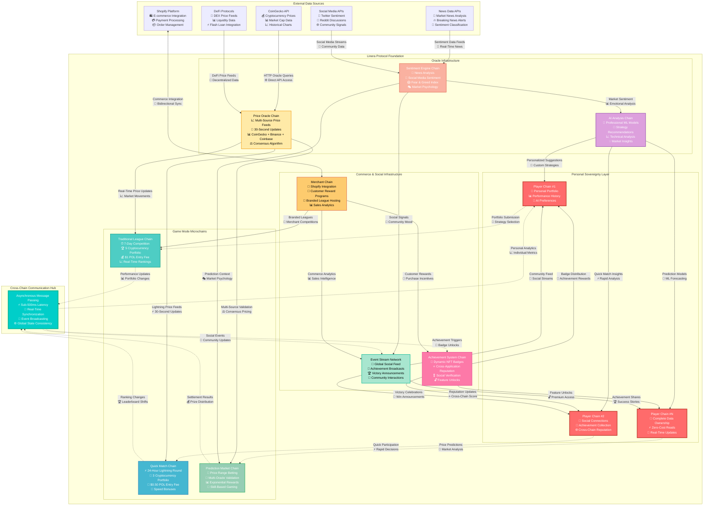
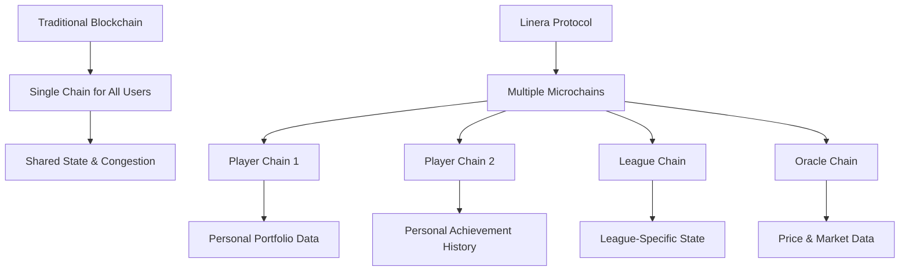
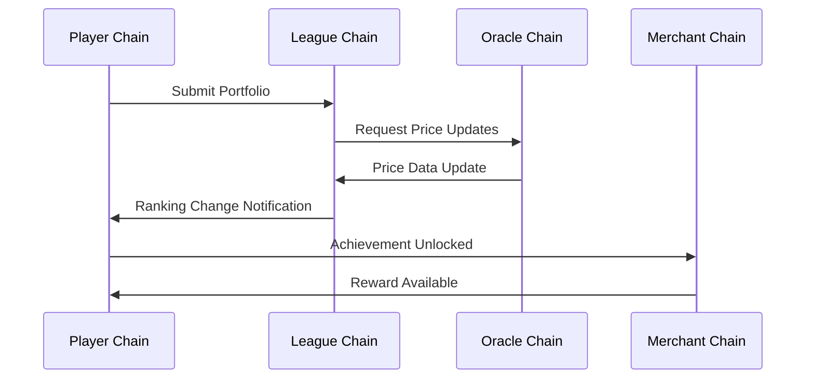

# Linera Architecture Overview

Understanding Linera's revolutionary microchain architecture is essential for building CoinDrafts applications. This section explains how Linera's unique features enable unprecedented capabilities in crypto gaming.

## Complete CoinDrafts-Linera Ecosystem



## Core Concepts

### Microchains: Individual Player Blockchains

In traditional blockchains, all users share a single chain. Linera introduces **microchains** - individual blockchains for specific purposes:



### Chain Ownership Models

Linera supports three ownership models perfectly suited for CoinDrafts:

#### Single-Owner Chains (Player Chains)

```rust
// Each player owns their personal microchain
struct PlayerChain {
    owner: AccountOwner,
    portfolio_history: LogView<Portfolio>,
    achievements: MapView<BadgeType, Achievement>,
    ai_preferences: RegisterView<AISettings>,
    social_connections: MapView<Address, FriendStatus>,
}
```

**Benefits for CoinDrafts:**

- **Complete data sovereignty** - players own their game history
- **Zero gas fees** for reading portfolio performance
- **Real-time updates** without network congestion
- **Privacy** - personal data never leaves player's control

#### Multi-Owner Chains (Team Leagues)

```rust
// Shared chains for collaborative gameplay
struct TeamLeagueChain {
    team_members: Vec<AccountOwner>,
    shared_strategy: RegisterView<TeamStrategy>,
    collective_portfolio: RegisterView<Portfolio>,
    team_achievements: LogView<TeamAchievement>,
}
```

**Use Cases:**

- Family leagues with shared management
- Corporate team competitions
- Community-driven investment clubs

#### Public Chains (Global Infrastructure)

```rust
// Public infrastructure chains
struct GlobalOracleChain {
    price_feeds: MapView<String, PriceData>,
    market_analysis: RegisterView<MarketReport>,
    ai_models: MapView<ModelId, AIModel>,
    public_leaderboards: RegisterView<GlobalRankings>,
}
```

**Functions:**

- Price oracle aggregation
- AI model hosting and updates
- Global leaderboards and statistics
- Cross-platform reputation system

## Cross-Chain Messaging

Linera's cross-chain messaging enables seamless communication between different microchains:

### Message Flow in CoinDrafts



### Implementation Example

```rust
// Cross-chain message types
#[derive(Debug, Serialize, Deserialize)]
pub enum CrossChainMessage {
    PortfolioSubmission {
        portfolio: Portfolio,
        league_id: LeagueId,
    },
    PriceUpdate {
        cryptocurrency: String,
        price: Amount,
        timestamp: Timestamp,
    },
    AchievementUnlocked {
        player: AccountOwner,
        achievement: Achievement,
    },
    RewardAvailable {
        recipient: AccountOwner,
        reward: Reward,
    },
}

// Sending messages between chains
async fn submit_portfolio_to_league(&mut self, portfolio: Portfolio, league_chain: ChainId) {
    let message = CrossChainMessage::PortfolioSubmission {
        portfolio,
        league_id: self.current_league_id(),
    };

    self.runtime.send_message(league_chain, message).await?;
}

// Receiving and processing messages
async fn execute_message(&mut self, message: CrossChainMessage) {
    match message {
        CrossChainMessage::PortfolioSubmission { portfolio, league_id } => {
            self.add_participant(portfolio.owner, portfolio).await?;
            self.update_leaderboard().await?;
        }
        CrossChainMessage::PriceUpdate { cryptocurrency, price, timestamp } => {
            self.update_crypto_price(cryptocurrency, price, timestamp).await?;
            self.recalculate_all_performances().await?;
        }
        // Handle other message types...
    }
}
```

## Native Oracle Integration

Linera's native HTTP support enables professional-grade oracles directly in smart contracts:

### Multi-Source Price Aggregation

```rust
// Oracle with native HTTP queries
impl OracleContract {
    async fn aggregate_prices(&mut self, crypto_id: String) -> Result<PriceData, OracleError> {
        // Query multiple price sources simultaneously
        let coingecko_future = self.runtime.http_query(&format!(
            "https://api.coingecko.com/api/v3/simple/price?ids={}&vs_currencies=usd",
            crypto_id
        ));

        let binance_future = self.runtime.http_query(&format!(
            "https://api.binance.com/api/v3/ticker/price?symbol={}USDT",
            crypto_id.to_uppercase()
        ));

        let coinbase_future = self.runtime.http_query(&format!(
            "https://api.coinbase.com/v2/exchange-rates?currency={}",
            crypto_id.to_uppercase()
        ));

        // Await all queries in parallel
        let (coingecko, binance, coinbase) = futures::try_join!(
            coingecko_future,
            binance_future,
            coinbase_future
        )?;

        // Aggregate with confidence scoring
        let aggregated_price = self.weighted_average_with_outlier_detection(
            vec![coingecko, binance, coinbase]
        )?;

        Ok(PriceData {
            price: aggregated_price,
            confidence: self.calculate_confidence_score(&sources),
            timestamp: self.runtime.current_timestamp(),
            sources: vec!["coingecko", "binance", "coinbase"],
        })
    }
}
```

### AI Market Analysis Oracle

```rust
// AI-powered market analysis with external data
impl AIStrategyOracle {
    async fn generate_market_insights(&mut self) -> Result<MarketInsights, AIError> {
        // Gather comprehensive market data
        let news_sentiment = self.runtime.http_query(
            "https://newsapi.org/v2/everything?q=cryptocurrency&sortBy=publishedAt&apiKey=XXX"
        ).await?;

        let social_sentiment = self.runtime.http_query(
            "https://api.lunarcrush.com/v2?data=market&type=fast&key=XXX"
        ).await?;

        let fear_greed_index = self.runtime.http_query(
            "https://api.alternative.me/fng/"
        ).await?;

        let options_data = self.runtime.http_query(
            "https://api.deribit.com/api/v2/public/get_book_summary_by_currency?currency=BTC"
        ).await?;

        // Run advanced ML analysis
        let insights = self.analyze_market_conditions(
            news_sentiment,
            social_sentiment,
            fear_greed_index,
            options_data
        ).await?;

        Ok(insights)
    }
}
```

## Event Streams for Real-Time Features

Linera's event streams enable reactive programming for live social features:

### Global Activity Stream

```rust
// Define event types for CoinDrafts
#[derive(Debug, Serialize, Deserialize)]
pub enum CoinDraftsEvent {
    PortfolioCreated {
        player: AccountOwner,
        portfolio: Portfolio,
        league: LeagueId,
    },
    LeaderboardUpdate {
        league: LeagueId,
        new_rankings: Vec<RankingEntry>,
    },
    AchievementUnlocked {
        player: AccountOwner,
        achievement: Achievement,
        rarity: AchievementRarity,
    },
    PriceAlert {
        cryptocurrency: String,
        price_change: f64,
        direction: PriceDirection,
    },
}

// Stream publisher (e.g., in league contract)
impl LeagueContract {
    async fn update_leaderboard(&mut self, new_rankings: Vec<RankingEntry>) {
        self.leaderboard.set(new_rankings.clone());

        // Publish event to global stream
        self.runtime.publish_event(CoinDraftsEvent::LeaderboardUpdate {
            league: self.league_id(),
            new_rankings,
        }).await?;
    }
}

// Stream subscriber (e.g., in player contract)
impl PlayerContract {
    async fn process_streams(&mut self, updates: Vec<StreamUpdate>) {
        for update in updates {
            match update.event {
                CoinDraftsEvent::LeaderboardUpdate { league, new_rankings } => {
                    if self.is_participating_in_league(league) {
                        self.update_personal_ranking(new_rankings).await?;
                        self.maybe_send_notification().await?;
                    }
                }
                CoinDraftsEvent::AchievementUnlocked { player, achievement, rarity } => {
                    if self.is_friend(player) {
                        self.celebrate_friend_achievement(player, achievement).await?;
                    }
                }
                // Handle other events...
            }
        }
    }
}
```

## Geographic Sharding (Future)

Linera's planned geographic sharding will optimize CoinDrafts for global users:

### Regional Tournament Architecture

```rust
// Regional chains for optimized latency
struct RegionalTournament {
    region: GeographicRegion, // US_WEST, EU_CENTRAL, ASIA_PACIFIC
    local_players: MapView<AccountOwner, PlayerProfile>,
    regional_leaderboard: RegisterView<RegionalRankings>,
    cross_region_qualifiers: LogView<QualificationEvent>,
}

// Global championship coordination
impl GlobalChampionship {
    async fn coordinate_world_championship(&mut self) {
        // Collect winners from each region
        let regions = vec![
            GeographicRegion::NorthAmerica,
            GeographicRegion::Europe,
            GeographicRegion::AsiaPacific,
            GeographicRegion::LatinAmerica,
        ];

        let mut global_participants = Vec::new();

        for region in regions {
            let regional_winners = self.get_regional_champions(region).await?;
            global_participants.extend(regional_winners);
        }

        // Create global championship chain
        let championship_chain = self.runtime.open_chain().await?;

        // Invite all regional winners
        for participant in global_participants {
            self.runtime.send_message(
                participant.home_chain,
                ChampionshipInvitation {
                    participant: participant.address,
                    championship_chain: championship_chain.id(),
                    prize_pool: self.calculate_global_prize_pool(),
                }
            ).await?;
        }
    }
}
```

## Performance Characteristics

### Comparison with Traditional Blockchains

| Feature                     | Traditional Blockchain | Linera Microchains          |
| --------------------------- | ---------------------- | --------------------------- |
| **Transaction Finality**    | 10+ seconds            | <0.5 seconds                |
| **Concurrent Users**        | Limited by gas limit   | Unlimited (parallel chains) |
| **Data Reads**              | Gas fees required      | Free for chain owners       |
| **Real-time Updates**       | Not possible           | Native support              |
| **Cross-App Communication** | External oracles       | Native messaging            |
| **Scalability**             | Vertical only          | Horizontal + vertical       |

### CoinDrafts-Specific Benefits

**Portfolio Tracking:**

- **Current**: Expensive on-chain queries, limited update frequency
- **Linera**: Free real-time tracking on personal chains

**League Management:**

- **Current**: Single contract bottleneck, gas competition
- **Linera**: Parallel leagues with dedicated resources

**Price Oracles:**

- **Current**: Centralized, update delays, manipulation risk
- **Linera**: Multi-source aggregation, real-time updates, consensus-based

**Social Features:**

- **Current**: Centralized servers, privacy concerns
- **Linera**: Decentralized event streams, user-controlled data

## Application Development Model

### Contract + Service Architecture

Every Linera application consists of two components:

```rust
// Contract: Gas-metered, state-modifying logic
#[linera_sdk::contract]
pub struct CoinDraftsContract {
    state: CoinDraftsState,
    runtime: ContractRuntime<Self>,
}

// Service: Non-metered, read-only GraphQL interface
#[linera_sdk::service]
pub struct CoinDraftsService {
    state: CoinDraftsState,
    runtime: Arc<ServiceRuntime<Self>>,
}
```

**Contract Responsibilities:**

- Process operations (portfolio submissions, prize distributions)
- Handle cross-chain messages
- Modify application state
- Validate business logic

**Service Responsibilities:**

- Provide GraphQL API for frontends
- Query application state
- Generate reports and analytics
- Serve real-time data to clients

### State Management with Views

Linera's view system provides efficient, flexible state management:

```rust
// Hierarchical state organization
#[derive(RootView, async_graphql::SimpleObject)]
#[view(context = ViewStorageContext)]
pub struct CoinDraftsState {
    // Player data
    pub players: MapView<AccountOwner, PlayerProfile>,
    pub portfolios: MapView<PortfolioId, Portfolio>,

    // League data
    pub active_leagues: MapView<LeagueId, League>,
    pub league_history: LogView<CompletedLeague>,

    // Market data
    pub price_feeds: MapView<String, PriceHistory>,
    pub market_analysis: RegisterView<MarketReport>,

    // Social features
    pub friend_connections: MapView<AccountOwner, Vec<AccountOwner>>,
    pub global_chat: LogView<ChatMessage>,
}
```

## Security Model

### Chain-Level Security

Each microchain inherits Linera's security properties:

- **Byzantine Fault Tolerance**: Same security as main Linera network
- **Validator Consensus**: All chains validated by same validator set
- **Cryptographic Signatures**: Ed25519 signatures for all operations
- **State Verification**: Merkle tree proofs for state integrity

### Application-Level Security

CoinDrafts implements additional security measures:

```rust
// Access control and validation
impl CoinDraftsContract {
    async fn execute_operation(&mut self, operation: Operation) -> Response {
        // Verify operation signature and permissions
        let signer = self.runtime.authenticated_signer();

        match operation {
            Operation::SubmitPortfolio { portfolio } => {
                // Validate portfolio constraints
                self.validate_portfolio(&portfolio)?;

                // Check league participation eligibility
                self.verify_league_eligibility(signer, portfolio.league_id)?;

                // Ensure no duplicate submissions
                self.check_no_duplicate_submission(signer, portfolio.league_id)?;

                self.process_portfolio_submission(signer, portfolio).await
            }
            // Handle other operations with appropriate validation...
        }
    }
}
```

This architecture provides the foundation for building unprecedented crypto gaming experiences on Linera. The next sections will dive into specific implementations for each CoinDrafts feature.

---

_Understanding Linera's architecture unlocks the full potential of next-generation Web3 applications_ 🏗️⚡
