# Linera Protocol Integration

This section demonstrates how CoinDrafts leverages every aspect of Linera's revolutionary protocol to create capabilities impossible on traditional blockchains.

## Linera vs Traditional Blockchain Architecture

```mermaid
graph TB
    subgraph "Traditional Blockchain (Polygon/Ethereum)"
        subgraph "Single Chain Limitations"
            SC[Single Shared Chain<br/>⚠️ Global State Congestion<br/>💸 High Gas Costs<br/>🐌 Slow Updates<br/>🔄 Limited Throughput]

            EO[External Oracles<br/>🔗 Chainlink Dependencies<br/>💰 Oracle Gas Costs<br/>⏰ Update Delays<br/>🎯 Limited Data Sources]

            CS[Centralized Services<br/>☁️ Off-Chain Dependencies<br/>🔒 Single Points of Failure<br/>📊 Limited AI Capabilities<br/>💾 Centralized Storage]
        end

        subgraph "Traditional Limitations"
            GL[Gas Limitations<br/>💸 Expensive Reads<br/>⚠️ Failed Transactions<br/>🐌 Network Congestion<br/>📈 Unpredictable Costs]

            SL[Scalability Limits<br/>🔒 Fixed Block Size<br/>⏰ Block Time Constraints<br/>🌐 Global Consensus Overhead<br/>📊 Limited Parallel Processing]

            DL[Data Limitations<br/>🔒 On-Chain Storage Costs<br/>📱 Limited External Access<br/>🤖 Restricted AI Integration<br/>⏰ Stale Information]
        end
    end

    subgraph "Linera Protocol Revolution"
        subgraph "Microchain Architecture"
            MC1[Personal Player Chains<br/>💎 Individual Ownership<br/>⚡ Zero-Cost Reads<br/>📊 Private State<br/>🔄 Real-Time Updates]

            MC2[Game Mode Chains<br/>🎮 Dedicated Instances<br/>♾️ Unlimited Parallel<br/>⚖️ Perfect Isolation<br/>🗑️ Auto-Cleanup]

            MC3[Oracle Chains<br/>🌐 Native HTTP Access<br/>🔄 Real-Time Data<br/>🧠 AI Integration<br/>📊 Multi-Source Aggregation]
        end

        subgraph "Revolutionary Capabilities"
            NO[Native Oracles<br/>🌐 Direct HTTP Queries<br/>⚡ Real-Time External Data<br/>🤖 AI Model Hosting<br/>📊 Multi-Source Validation]

            ES[Event Streams<br/>📡 Global Message Broadcasting<br/>🔄 Real-Time Social Features<br/>🎉 Instant Notifications<br/>💬 Live Community Feeds]

            CCM[Cross-Chain Messaging<br/>⚡ Sub-500ms Latency<br/>🔄 Asynchronous Communication<br/>📨 Event-Driven Architecture<br/>🌐 Global State Coordination]
        end

        subgraph "Performance Benefits"
            ZC[Zero-Cost Operations<br/>📖 Free State Reads<br/>💰 No Gas for Queries<br/>🔄 Unlimited Data Access<br/>📊 Real-Time Analytics]

            RT[Real-Time Performance<br/>⚡ Sub-Second Finality<br/>🔄 Instant State Updates<br/>📈 Live Price Feeds<br/>🏆 Dynamic Leaderboards]

            US[Unlimited Scalability<br/>♾️ Parallel Processing<br/>📈 Auto-Scaling Chains<br/>🔄 Elastic Capacity<br/>🌐 Global Distribution]
        end
    end

    %% Traditional Blockchain Connections (showing limitations)
    SC -.->|Expensive Interactions| GL
    EO -.->|Oracle Delays| SL
    CS -.->|Centralized Risks| DL

    %% Linera Protocol Connections (showing advantages)
    MC1 -->|Personal Sovereignty| ZC
    MC2 -->|Dedicated Performance| RT
    MC3 -->|Oracle Integration| US

    NO -->|Real-Time Data| ES
    ES -->|Global Coordination| CCM
    CCM -->|Instant Messaging| MC1
    CCM -->|Event Distribution| MC2
    CCM -->|Data Synchronization| MC3

    %% Styling for Comparison
    style SC fill:#ffcccc,stroke:#cc0000,stroke-width:2px,color:#000
    style EO fill:#ffcccc,stroke:#cc0000,stroke-width:2px,color:#000
    style CS fill:#ffcccc,stroke:#cc0000,stroke-width:2px,color:#000
    style GL fill:#ffdddd,stroke:#cc3333,stroke-width:1px,color:#000
    style SL fill:#ffdddd,stroke:#cc3333,stroke-width:1px,color:#000
    style DL fill:#ffdddd,stroke:#cc3333,stroke-width:1px,color:#000

    style MC1 fill:#ccffcc,stroke:#00cc00,stroke-width:3px,color:#000
    style MC2 fill:#ccffcc,stroke:#00cc00,stroke-width:3px,color:#000
    style MC3 fill:#ccffcc,stroke:#00cc00,stroke-width:3px,color:#000
    style NO fill:#ccffff,stroke:#0066cc,stroke-width:2px,color:#000
    style ES fill:#ccffff,stroke:#0066cc,stroke-width:2px,color:#000
    style CCM fill:#ccffff,stroke:#0066cc,stroke-width:2px,color:#000
    style ZC fill:#ffffcc,stroke:#cccc00,stroke-width:2px,color:#000
    style RT fill:#ffffcc,stroke:#cccc00,stroke-width:2px,color:#000
    style US fill:#ffffcc,stroke:#cccc00,stroke-width:2px,color:#000
```



## CoinDrafts Feature Mapping to Linera Capabilities

| CoinDrafts Feature        | Traditional Blockchain     | Linera Protocol           | Advantage                  |
| ------------------------- | -------------------------- | ------------------------- | -------------------------- |
| **Personal Portfolios**   | Shared contract state      | Individual player chains  | 💎 Complete data ownership |
| **Real-Time Updates**     | Hourly price feeds         | 30-second oracle updates  | ⚡ 120x faster updates     |
| **Portfolio Tracking**    | $0.05 gas per read         | Zero-cost chain reads     | 💰 100% cost reduction     |
| **AI Recommendations**    | Client-side TensorFlow.js  | Native oracle ML models   | 🧠 Professional-grade AI   |
| **Social Features**       | Off-chain centralized      | Event stream integration  | 📡 Decentralized social    |
| **Achievement System**    | Static ERC-721 NFTs        | Dynamic evolving badges   | 🏅 Living achievements     |
| **Multi-League Support**  | Single contract bottleneck | Unlimited parallel chains | ♾️ Infinite scalability    |
| **Price Validation**      | Single Chainlink oracle    | Multi-source consensus    | ⚖️ Superior accuracy       |
| **Merchant Integration**  | External payment systems   | Native commerce chains    | 🛒 Unified Web3 experience |
| **Cross-Game Reputation** | Isolated application data  | Cross-chain reputation    | 🌐 Universal recognition   |

## Linera-Specific Implementation Examples

### Personal Chain Architecture

```rust
// Each player gets their own sovereign microchain
#[derive(RootView)]
#[view(context = ViewStorageContext)]
pub struct PlayerChain {
    // Portfolio management with zero-cost reads
    pub portfolio_history: LogView<PortfolioEntry>,

    // Real-time performance tracking
    pub performance_metrics: MapView<Timestamp, PerformanceSnapshot>,

    // AI learning and personalization
    pub ai_preferences: RegisterView<PlayerAIProfile>,

    // Social connections and reputation
    pub social_connections: MapView<AccountOwner, SocialConnection>,

    // Achievement collection with dynamic progression
    pub achievements: MapView<BadgeType, DynamicAchievement>,
}
```

### Native Oracle Integration

```rust
// Professional-grade AI with native HTTP access
impl AIAnalysisContract {
    async fn generate_market_analysis(&mut self, crypto: &str) -> Result<MarketAnalysis, AIError> {
        // Direct HTTP queries to external APIs (impossible on traditional chains)
        let price_data = self.runtime.http_query(&format!(
            "https://api.coingecko.com/api/v3/simple/price?ids={}&vs_currencies=usd&include_24hr_change=true",
            crypto
        )).await?;

        let news_sentiment = self.runtime.http_query(&format!(
            "https://newsapi.org/v2/everything?q={}&language=en&sortBy=publishedAt",
            crypto
        )).await?;

        let social_sentiment = self.runtime.http_query(&format!(
            "https://api.twitter.com/2/tweets/search/recent?query={}&tweet.fields=public_metrics",
            crypto
        )).await?;

        // Run sophisticated ML models with real-time data
        self.run_comprehensive_analysis(price_data, news_sentiment, social_sentiment).await
    }
}
```

### Cross-Chain Event Streams

```rust
// Global social features through event streams
impl SocialEventSystem {
    async fn broadcast_achievement(&self, event: AchievementEvent) -> Result<(), EventError> {
        // Instant global broadcasting (impossible on single-chain systems)
        self.runtime.publish_event(SocialEvent::AchievementUnlocked {
            player: event.player,
            achievement: event.achievement,
            rarity: event.rarity,
            celebration_tier: self.calculate_celebration_tier(&event),
        }).await?;

        // Automatically trigger cross-application updates
        self.update_cross_chain_reputation(event.player, &event.achievement).await?;

        Ok(())
    }
}
```

### Unlimited Parallel Game Instances

```rust
// Unlimited concurrent leagues without performance impact
impl LeagueOrchestrator {
    async fn create_new_league(&mut self, config: LeagueConfig) -> Result<ChainId, OrchestratorError> {
        // Create dedicated microchain for this league
        let league_chain = self.runtime.create_chain(
            ChainType::TemporaryLeague,
            config.clone()
        ).await?;

        // Perfect isolation - no impact on other leagues
        league_chain.initialize_league_state(config).await?;

        // Auto-cleanup after competition ends
        league_chain.schedule_expiry(config.end_time).await?;

        Ok(league_chain.id())
    }
}
```

## Performance Comparison Matrix

### Traditional Blockchain vs Linera Protocol

```mermaid
graph LR
    subgraph "Performance Metrics"
        subgraph "Update Frequency"
            T1[Traditional: Hourly]
            L1[Linera: 30 Seconds]
            L1 --> T1
        end

        subgraph "Read Costs"
            T2[Traditional: $0.05 Gas]
            L2[Linera: Zero Cost]
            L2 --> T2
        end

        subgraph "Scalability"
            T3[Traditional: Limited]
            L3[Linera: Unlimited]
            L3 --> T3
        end

        subgraph "AI Capabilities"
            T4[Traditional: Client-Side]
            L4[Linera: Native Oracles]
            L4 --> T4
        end

        subgraph "Social Features"
            T5[Traditional: Centralized]
            L5[Linera: Event Streams]
            L5 --> T5
        end
    end

    style L1 fill:#00ff00,stroke:#009900,color:#fff
    style L2 fill:#00ff00,stroke:#009900,color:#fff
    style L3 fill:#00ff00,stroke:#009900,color:#fff
    style L4 fill:#00ff00,stroke:#009900,color:#fff
    style L5 fill:#00ff00,stroke:#009900,color:#fff

    style T1 fill:#ff9999,stroke:#cc0000,color:#000
    style T2 fill:#ff9999,stroke:#cc0000,color:#000
    style T3 fill:#ff9999,stroke:#cc0000,color:#000
    style T4 fill:#ff9999,stroke:#cc0000,color:#000
    style T5 fill:#ff9999,stroke:#cc0000,color:#000
```



## Revolutionary Capabilities Enabled by Linera

### 1. **Data Sovereignty** 💎

- Each player owns their complete gaming history
- Zero-cost access to personal data
- No platform lock-in or data silos

### 2. **Real-Time Gaming** ⚡

- Sub-second portfolio updates
- Live leaderboard changes
- Instant notifications and reactions

### 3. **Professional AI** 🧠

- Native oracle access to external APIs
- Sophisticated ML models with fresh data
- Personalized strategy recommendations

### 4. **Unlimited Scalability** ♾️

- Parallel game instances without performance impact
- Auto-scaling based on demand
- Perfect isolation between competitions

### 5. **Cross-Application Ecosystem** 🌐

- Reputation and achievements work across all Linera apps
- Composability with other gaming platforms
- Network effects amplification

### 6. **Native Commerce** 🛒

- Integrated e-commerce without bridges
- Instant reward redemption
- Unified crypto-native experience

This architecture represents a fundamental leap forward in Web3 gaming capabilities, made possible only through Linera's revolutionary protocol design.

---

_Revolutionary capabilities powered by Linera's next-generation blockchain architecture_ 🚀💎
