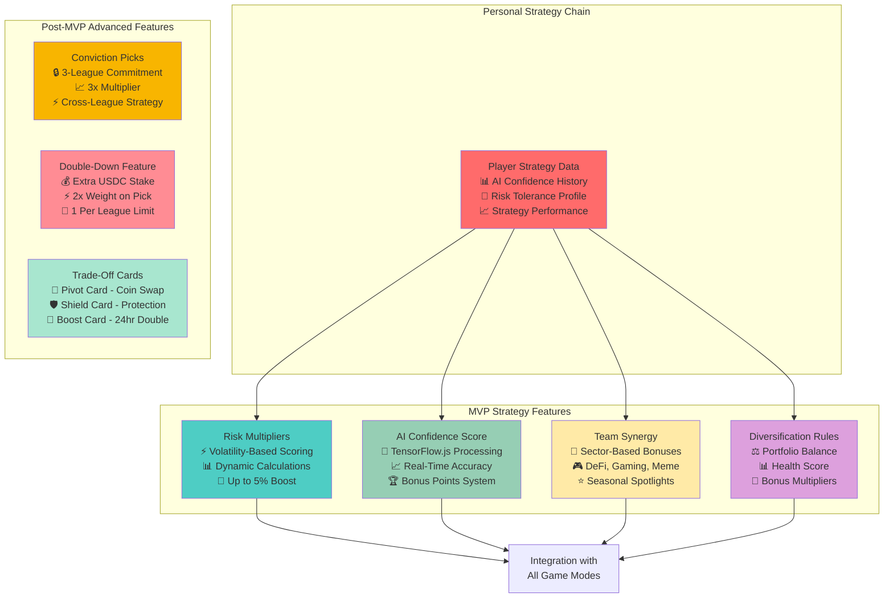

# Strategy Systems Overview

CoinDrafts on Linera introduces sophisticated strategy layers that reward skill, research, and tactical decision-making. These systems leverage Linera's microchain architecture to provide real-time strategy execution and personalized analytics.

## 🎯 Core Strategy Philosophy

Our strategy systems are designed around three key principles:

1. **Skill-Based Rewards** - Knowledge and research should determine success
2. **Balanced Competition** - No single strategy should dominate
3. **Fair Play** - Maximum 5% performance boosts prevent pay-to-win scenarios

## 📊 Strategy Feature Architecture



## 🚀 MVP Strategy Features (Phase 1)

### 1. Risk Multipliers

Transform volatility into opportunity with dynamic risk-reward calculations.

**How It Works:**

- Each cryptocurrency receives a volatility score based on 7-day rolling average
- Higher volatility = higher reward potential (up to 5% boost)
- Encourages skilled risk assessment and market analysis

**Example:**

```
Bitcoin (Low Volatility): 1.0x multiplier
Ethereum (Medium Volatility): 1.02x multiplier
Solana (High Volatility): 1.05x multiplier
PEPE (Extreme Volatility): 1.05x multiplier (capped)
```

**Linera Integration:**

- Real-time volatility calculations on Oracle chains
- Personal risk tolerance learning on Player chains
- Cross-chain messaging for instant multiplier updates

### 2. AI Confidence Score

Professional-grade AI analysis with transparency and bonus rewards.

**Features:**

- **TensorFlow.js Integration**: Client-side ML processing for predictions
- **Real-Time Accuracy**: Live confidence scoring as markets move
- **Bonus Point System**: High-confidence picks earn additional rewards
- **Historical Tracking**: Personal chains store confidence score performance

**Confidence Levels:**

- 🔴 **Low (0-40%)**: No bonus, higher risk warning
- 🟡 **Medium (41-70%)**: Standard scoring
- 🟢 **High (71-85%)**: +2% bonus points
- 🟦 **Very High (86-95%)**: +3% bonus points
- 🟪 **Expert (96-100%)**: +5% bonus points

**AI Model Features:**

- Technical indicator analysis
- Social sentiment integration
- Market correlation patterns
- Personal strategy optimization

### 3. Team Synergy

Sector-based strategy bonuses that reward market knowledge.

**Sector Categories:**

- 🏦 **DeFi**: AAVE, UNI, COMP, SUSHI, CRV
- 🎮 **Gaming**: AXS, SAND, MANA, ENJ, GALA
- 🏗️ **Infrastructure**: DOT, ATOM, AVAX, NEAR, FTM
- 😂 **Meme**: DOGE, SHIB, PEPE, FLOKI, BONK
- 🔒 **Privacy**: XMR, ZEC, ROSE, SCRT
- 🌐 **Layer 1**: BTC, ETH, SOL, ADA, MATIC

**Synergy Bonuses:**

- **2 Same Sector**: +1% portfolio bonus
- **3 Same Sector**: +2% portfolio bonus
- **4+ Same Sector**: +3% portfolio bonus (max)

**Seasonal Events:**

- Monthly "Sector Spotlight" with double bonuses
- Market condition-based sector advantages
- Community voting for bonus sectors

### 4. Diversification Rules

Smart portfolio balance requirements with reward multipliers.

**Portfolio Health Metrics:**

- **Sector Distribution**: Balanced across categories
- **Market Cap Mix**: Large/Mid/Small cap balance
- **Risk Profile**: Volatility distribution analysis
- **Correlation Score**: Independence of price movements

**Health Score Benefits:**

- **90-100%**: Perfect balance - 2% total portfolio bonus
- **80-89%**: Good balance - 1% total portfolio bonus
- **70-79%**: Acceptable balance - No bonus/penalty
- **Below 70%**: Risky concentration - Warning displayed

## 🔮 Advanced Strategy Features (Phase 2)

### 5. Conviction Picks

Cross-league commitment strategy for dedicated players.

**Mechanism:**

- Lock 1 cryptocurrency across 3 consecutive leagues
- Cannot change this pick for entire commitment period
- Receive 3x multiplier on that cryptocurrency's performance
- Risk: Locked into choice regardless of market changes

**Strategic Considerations:**

- Requires deep market conviction and research
- Higher risk/reward than standard gameplay
- Tests long-term vs short-term strategy skills
- Creates interesting spectator dynamics

### 6. Double-Down Feature

Tactical USDC staking for enhanced portfolio weighting.

**Rules:**

- Stake additional USDC on one cryptocurrency pick
- Receive 2x weight on that selection's performance
- Limited to 1 double-down per league
- USDC amount determines weight multiplier (up to 5% total boost)

**Risk/Reward:**

- **Success**: Enhanced rewards from confident pick
- **Failure**: Lose staked USDC tokens
- **Strategy**: Best used with high AI confidence scores

### 7. Trade-Off Cards

Mid-game tactical decisions using USDC tokens.

**Card Types:**

#### 🔄 Pivot Card

- **Function**: Swap one cryptocurrency for another mid-league
- **Cost**: Low USDC amount
- **Strategy**: React to unexpected market events
- **Limitation**: Once per league

#### 🛡️ Shield Card

- **Function**: Protect worst-performing pick from penalties
- **Cost**: Medium USDC amount
- **Strategy**: Damage control for poor selections
- **Limitation**: Can't boost, only prevents loss

#### 🚀 Boost Card

- **Function**: Double one cryptocurrency's gains for 24 hours
- **Cost**: High USDC amount
- **Strategy**: Capitalize on predicted short-term pumps
- **Limitation**: Timing is critical

## 🎮 Game Mode Integration

### Traditional Leagues (7-Day)

- **All Features Available**: Complete strategy depth
- **Time for Analysis**: Perfect for complex strategies
- **Conviction Picks**: Ideal timeframe for commitment strategies

### Quick Match (24-Hour)

- **Simplified Strategy**: Risk Multipliers + AI Confidence only
- **Fast Decisions**: Limited time for deep analysis
- **Boost Cards**: 24-hour timeframe perfect for timing plays

### Price Range Prediction

- **AI-Heavy**: Confidence scores are crucial
- **Sector Analysis**: Team synergy for correlated predictions
- **No Trade-Off Cards**: Prediction locks at submission

## 📊 Strategy Performance Analytics

### Personal Chain Tracking

- **Strategy Success Rates**: Which approaches work best
- **Risk-Adjusted Returns**: Performance vs risk taken
- **AI Confidence Accuracy**: Personal model improvement
- **Sector Expertise**: Strengths and weaknesses analysis

### Global Strategy Insights

- **Popular Strategies**: Community trend analysis
- **Success Correlations**: What combinations work
- **Market Condition Adaptation**: Strategy effectiveness by market
- **Skill Development**: Learning curve analytics

## 🔗 Cross-Chain Strategy Execution

### Real-Time Processing

- **Instant Updates**: Strategy calculations update with price movements
- **Cross-Chain Messaging**: Coordinate between personal and game chains
- **Oracle Integration**: Live data feeds for all strategy features

### Personal Strategy Learning

- **Adaptive AI**: Personal models improve with each league
- **Risk Tolerance**: System learns individual preferences
- **Success Patterns**: Identify what works for each player
- **Recommendation Engine**: Suggest optimal strategy combinations

---

## 🎯 Getting Started with Strategy

Ready to elevate your CoinDrafts gameplay? Here's how to begin:

1. **Start Simple**: Begin with Risk Multipliers and AI Confidence
2. **Learn Sectors**: Research cryptocurrency categories for synergy bonuses
3. **Balance Portfolios**: Aim for high diversification scores
4. **Track Performance**: Monitor your personal strategy analytics
5. **Advanced Features**: Unlock conviction picks and trade-off cards as you gain experience

The future of crypto gaming is strategic, skill-based, and powered by Linera's revolutionary microchain architecture! 🚀
